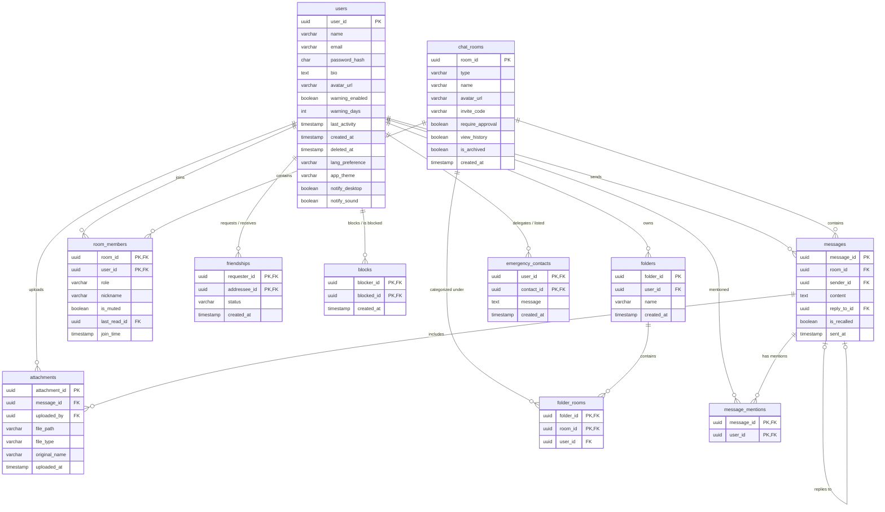
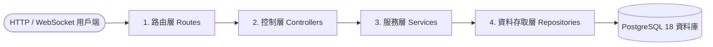

# Real-Time Messaging System | 即時文字通訊系統

A real-time group chat application built as an NTNU Database Theories course project. This monorepo features a Next.js frontend, a Node.js/Express backend API using raw SQL query pools, and a PostgreSQL database orchestrating custom permissions, chat folders, message lifecycle triggers, and emergency contact alerts.

國立臺灣師範大學資料庫系統概論期末專案——即時文字通訊與群組聊天系統。本專案採 Monorepo 架構，結合 Next.js 前端、Node.js/Express 後端，以 Raw SQL 直接操作 PostgreSQL 進行高效查詢，並實現自訂群組權限、聊天分類資料夾、訊息生命週期，以及離線警報（遺言模式）等具體資料庫應用。

---

## Table of Contents | 目錄

- [English Version](#english-version)
  - [Key Features](#key-features)
  - [Database & Architecture](#database--architecture)
  - [Tech Stack](#tech-stack)
  - [Project Structure](#project-structure)
  - [Getting Started](#getting-started)
  - [Testing](#testing)
- [繁體中文版](#繁體中文版)
  - [核心功能](#核心功能)
  - [資料庫與架構設計](#資料庫與架構設計)
  - [技術棧](#技術棧)
  - [專案目錄結構](#專案目錄結構)
  - [快速開始](#快速開始)
  - [測試指令](#測試指令)

---

# English Version

## Key Features

1. **Real-time Messaging & Status**: Seamless private and group messaging powered by Socket.IO with dynamic online status indicators.
2. **Granular Chat Room Permissions**:
   - Customizable user roles (`owner`, `admin`, `member`, `pending`).
   - Mute control (`is_muted`), room-specific custom user nicknames, and approval workflows (`require_approval`).
   - Selective history visibility for new members (`view_history`).
3. **Emergency Auto-Contact / "Last Words" Mode**: 
   - Uses scheduler rules checking users' `last_activity`.
   - When a user goes offline exceeding `warning_days`, pre-defined emergency messages are dispatched automatically to emergency contacts.
4. **Chat Folder Categorization**: Users can organize multiple chat rooms into customizable directories (`folders` and `folder_rooms`).
5. **Message Lifecycle & Actions**: Supports replying to messages (`reply_to_id`), message recalls (`is_recalled`), attachments, and soft deletes (`deleted_at`).
6. **End-to-End Encryption**: Messages are encrypted client-side with per-room AES-256-GCM keys (wrapped via RSA-OAEP per member into `room_keys`), so the database only stores `E2E.v1` ciphertext envelopes; search runs locally over decrypted content. See [docs/e2e-encryption.md](docs/e2e-encryption.md).

## Database & Architecture

### Entity-Relationship (ER) Diagram

The system relies on PostgreSQL 18 to handle complex relationships and cascading deletes. Below is the comprehensive ER diagram representing the database layout:



For the detailed database schema layout and foreign keys, refer to [Relation Schema Guide](docs/relation-schema.md) and [ER Diagram Details](docs/er_diagram.md).

### Backend Layered Architecture

To keep the codebase maintainable and scalable, the backend implements a strict 4-layer architecture:


1. **Routes (Route Layer)**: 
   Defines API endpoints and mounts middlewares for request validation, rate limiting, and JWT authentication.
2. **Controllers (Control Layer)**:
   Extracts inputs from requests (`params`, `query`, `body`), passes them to the Service layer, and returns standardized HTTP responses.
3. **Services (Service Layer)**:
   Implements business logic (e.g. permission checks, validation rules, business invariants) without being coupled to Express or SQL.
4. **Repositories (Data Access Layer)**:
   Communicates directly with the database using raw SQL queries with parameterised placeholders via the `pg` driver.

For details on this structure, refer to the development blueprint in [PLAN.md](PLAN.md).

## Tech Stack

- **Frontend**: Next.js 16.2 (App Router), React 19, Tailwind CSS v4, Socket.IO Client.
- **Backend**: Node.js, Express v5, Socket.IO, `pg` (PostgreSQL raw client).
- **Database**: PostgreSQL 18.
- **Orchestration**: Docker & Docker Compose.
- **Package Manager**: pnpm.

## Project Structure

```text
.
├── backend/                # Express API backend
│   ├── src/                # Backend TypeScript source code (routes, controllers, services, repositories)
│   ├── migrations/         # PostgreSQL node-pg-migrate schema migrations
│   └── Dockerfile          # Backend container configurations
├── frontend/               # Next.js frontend web app
│   ├── app/                # React App Router pages and layouts
│   ├── components/         # Reusable styling & UI components
│   └── Dockerfile          # Frontend container configurations
├── shared/                 # Shared TypeScript models and types (mounted read-only)
├── docs/                   # Full documentation (DESIGN, DEVELOPMENT, TESTING, APIs)
├── docker-compose.yml      # Local multi-container development orchestration
└── README.md               # Overview and orientation index
```

## Getting Started

Detailed configuration guides can be found in [docs/DEVELOPMENT.md](docs/DEVELOPMENT.md).

### 1. Copy Environment Settings
Copy the development environment example file (the defaults work out of the box):
```bash
cp .env.example .env
```

### 2. Boot Services
Build and run the containers using Docker Compose:
```bash
docker compose up -d
```

### 3. Initialize Database Schema & Seed Data
Execute the database migration runner and seed scripts:
```bash
docker compose exec backend pnpm run migrate:up
docker compose exec backend pnpm run db:seed
```
*Note: The seed script resets your database and generates 6 pre-configured users (e.g. `alice@test.com`, password: `password123`) for testing.*

### 4. Port Access Table

| Service | Address | Description |
| :--- | :--- | :--- |
| **Frontend App** | [http://localhost:3005](http://localhost:3005) | Main Next.js web application |
| **Backend API** | [http://localhost:4005](http://localhost:4005) | Express API & Socket.IO server |
| **PostgreSQL Database** | `localhost:5435` | PostgreSQL 18 instance (Mapped from internal port `5432`) |

---

## Testing

Ensure your containers are healthy, then trigger the test suites:

```bash
# Unit Tests (TypeScript compilation & mocked tests)
docker compose exec backend pnpm run test:unit

# Integration Tests (Launches ephemeral test DB from docker-compose.test.yml)
docker compose exec backend pnpm run test:db:up
docker compose exec backend pnpm run test:integration
```
For more testing details, see [docs/TESTING.md](docs/TESTING.md).

---

# 繁體中文版

## 核心功能

1. **即時訊息與狀態**: 基於 Socket.IO 實現的即時單人與群組對話，包含動態在線狀態指示器。
2. **細粒度群組權限管理**:
   - 可自訂成員權限角色（`owner`、`admin`、`member`、`pending`）。
   - 包含禁言狀態 (`is_muted`)、聊天室別名、加入審核機制 (`require_approval`) 等功能。
   - 新成員可選擇性檢視聊天室歷史紀錄 (`view_history`)。
3. **遺言模式與緊急警報**:
   - 定期調度器會檢查使用者的 `last_activity` 活躍時間。
   - 當使用者離線天數超過設定的 `warning_days` 時，系統會自動向設定好的緊急聯絡人發送預設訊息。
4. **聊天分類資料夾**: 使用者可透過自訂資料夾分類聊天對話框（透過 `folders` 及 `folder_rooms` 關聯）。
5. **訊息生命週期控制**: 支援回覆訊息 (`reply_to_id`)、訊息收回 (`is_recalled`)、檔案附件關聯以及軟刪除機制 (`deleted_at`)。
6. **端對端加密 (E2EE)**: 訊息於客戶端以每房間一把的 AES-256-GCM 金鑰加密（金鑰再以各成員 RSA-OAEP 公鑰包裝存入 `room_keys`），資料庫僅儲存 `E2E.v1` 密文信封，並支援前端本地解密搜尋。架構設計詳見 [docs/e2e-encryption.md](docs/e2e-encryption.md)。

## 資料庫與架構設計

### Entity-Relationship (ER) 關係圖

本專案使用 PostgreSQL 18 資料庫，藉由嚴謹的外鍵關聯與級聯刪除（Cascading Deletes）機制維護資料一致性。以下為核心 ER 圖：


詳細資料庫欄位及關聯細節請參閱：[關聯架構說明](docs/relation-schema.md) 以及 [ER 圖詳細說明](docs/er_diagram.md)。

### 後端分層架構

為確保程式碼的高可維護性與擴充性，後端專案嚴格落實四層分層架構設計：



1. **路由層 (Routes)**:
   定義 API 端點 (Endpoints)，並掛載 JWT 身份驗證、欄位格式驗證及限流等中間件。
2. **控制層 (Controllers)**:
   負責解析與提取請求參數 (`params`、`query`、`body`)，分發給服務層處理，並回傳標準化的 HTTP 回應格式。
3. **服務層 (Services)**:
   實作核心業務邏輯（如成員權限校驗、業務限制規則驗證），不與 Express 或 SQL 產生直接耦合。
4. **資料存取層 (Repositories)**:
   使用 raw SQL 語法，透過 `pg` 驅動直接與 PostgreSQL 資料庫進行讀寫操作。

詳細的架構說明與程式碼範例請參考後端開發藍圖：[PLAN.md](PLAN.md)。

## 技術棧

- **前端**: Next.js 16.2 (App Router), React 19, Tailwind CSS v4, Socket.IO Client。
- **後端**: Node.js, Express v5, Socket.IO, `pg` (PostgreSQL 原始驅動)。
- **資料庫**: PostgreSQL 18。
- **環境編排**: Docker 與 Docker Compose。
- **套件管理**: pnpm。

## 專案目錄結構

```text
.
├── backend/                # Express API 後端服務
│   ├── src/                # 後端 TypeScript 源碼 (routes, controllers, services, repositories)
│   ├── migrations/         # PostgreSQL node-pg-migrate 遷移腳本
│   └── Dockerfile          # 後端映像檔配置
├── frontend/               # Next.js 前端網頁應用
│   ├── app/                # React App Router 頁面與佈局
│   ├── components/         # 樣式與 UI 元件
│   └── Dockerfile          # 前端映像檔配置
├── shared/                 # 前後端共享 TypeScript 型別定義 (唯讀掛載)
├── docs/                   # 系統設計、開發指南、測試及 API 完整文檔
├── docker-compose.yml      # 本地多容器開發環境配置
└── README.md               # 專案概覽與索引
```

## 快速開始

詳細的開發說明文件請參考：[docs/DEVELOPMENT.md](docs/DEVELOPMENT.md)。

### 1. 複製環境變數範本
複製本地開發環境變數設定檔（預設值已完成配置，複製後即可直接使用）：
```bash
cp .env.example .env
```

### 2. 啟動服務容器
使用 Docker Compose 編譯並啟動所有服務：
```bash
docker compose up -d
```

### 3. 執行資料庫遷移與 mock 測試資料匯入
當資料庫容器順利運作後，執行資料表建立與 Mock 資料寫入：
```bash
docker compose exec backend pnpm run migrate:up
docker compose exec backend pnpm run db:seed
```
*備註: Seeding 腳本會重置資料庫，並自動建立 6 位預設的使用者（如：`alice@test.com`，預設密碼為 `password123`）供開發測試。*

### 4. 服務連接埠對照表

| 服務名稱 | 訪問網址 | 描述 |
| :--- | :--- | :--- |
| **前端應用 (Frontend)** | [http://localhost:3005](http://localhost:3005) | 主 Next.js 網頁應用介面 |
| **後端服務 (Backend API)** | [http://localhost:4005](http://localhost:4005) | Express API 及 Socket.IO 伺服器 |
| **PostgreSQL 資料庫** | `localhost:5435` | PostgreSQL 18 資料庫 (容器內部對應 `5432` 連接埠) |

---

## 測試指令

請確保開發容器皆正常啟動，接著執行對應測試：

```bash
# 單元測試 (TypeScript 編譯與模擬測試)
docker compose exec backend pnpm run test:unit

# 整合測試 (啟動 docker-compose.test.yml 定義的暫時性資料庫進行測試)
docker compose exec backend pnpm run test:db:up
docker compose exec backend pnpm run test:integration
```
詳細測試規範請參閱 [docs/TESTING.md](docs/TESTING.md)。
