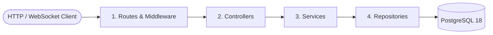

# Near Chat

English | [繁體中文](README.zh-TW.md)

A real-time group chat application built as an NTNU Database Theories course project. This monorepo features a Next.js frontend, a Node.js/Express backend API using raw SQL query pools, and a PostgreSQL database orchestrating custom permissions, chat folders, message lifecycle triggers, and emergency contact alerts.

---

## Table of Contents

- [Key Features](#key-features)
- [Database & Architecture](#database--architecture)
- [Tech Stack](#tech-stack)
- [Project Structure](#project-structure)
- [Getting Started](#getting-started)
- [Testing](#testing)

---

## Key Features

1. **Real-time Messaging & Status**: Seamless private and group messaging powered by Socket.IO with dynamic online status indicators.
2. **Granular Chat Room Permissions**:
   - Customizable user roles (`owner`, `admin`, `member`, `pending`).
   - Mute control (`is_muted`), room-specific custom user nicknames, and approval workflows (`require_approval`).
   - Selective history visibility for new members (`view_history`).
3. **Emergency Auto-Contact / "Last Words" Mode**: 
   - Uses scheduler rules checking users' `last_activity`.
   - When a user goes offline exceeding `warning_days`, pre-defined emergency messages are dispatched automatically to emergency contacts.
4. **Chat Folder Categorization**: Users can organize multiple chat rooms into customizable directories (`folders` and `folder_rooms`).
5. **Message Lifecycle & Actions**: Supports replying to messages (`reply_to_id`), message recalls (`is_recalled`), attachments, and soft deletes (`deleted_at`).

## Database & Architecture

### Backend Layered Architecture

To keep the codebase maintainable and scalable, the backend implements a strict 4-layer architecture:



1. **Routes (Route Layer)**: 
   Defines API endpoints and mounts middlewares for request validation, rate limiting, and JWT authentication.
2. **Controllers (Control Layer)**:
   Extracts inputs from requests (`params`, `query`, `body`), passes them to the Service layer, and returns standardized HTTP responses.
3. **Services (Service Layer)**:
   Implements business logic (e.g. permission checks, validation rules, business invariants) without being coupled to Express or SQL.
4. **Repositories (Data Access Layer)**:
   Communicates directly with the database using raw SQL queries with parameterised placeholders via the `pg` driver.

## Tech Stack

- **Frontend**: Next.js 16.2 (App Router), React 19, Tailwind CSS v4, Socket.IO Client.
- **Backend**: Node.js, Express v5, Socket.IO, `pg` (PostgreSQL raw client).
- **Database**: PostgreSQL 18.
- **Orchestration**: Docker & Docker Compose.
- **Package Manager**: pnpm.

## Project Structure

```text
.
├── backend/                # Express API backend
│   ├── src/                # Backend TypeScript source code (routes, controllers, services, repositories)
│   ├── migrations/         # PostgreSQL node-pg-migrate schema migrations
│   └── Dockerfile          # Backend container configurations
├── frontend/               # Next.js frontend web app
│   ├── app/                # React App Router pages and layouts
│   ├── components/         # Reusable styling & UI components
│   └── Dockerfile          # Frontend container configurations
├── shared/                 # Shared TypeScript models and types (mounted read-only)
├── docs/                   # Full documentation (DESIGN, DEVELOPMENT, TESTING, APIs)
├── docker-compose.yml      # Local multi-container development orchestration
└── README.md               # Overview and orientation index
```

## Getting Started

Detailed configuration guides can be found in [docs/DEVELOPMENT.md](docs/DEVELOPMENT.md).

### 1. Copy Environment Settings
Copy the development environment example file (the defaults work out of the box):
```bash
cp .env.example .env
```

### 2. Boot Services
Build and run the containers using Docker Compose:
```bash
docker compose up -d
```
The backend container automatically runs all pending database migrations on startup before the dev server launches.

### Attachment Upload Configuration
Attachment uploads are type-open by default, with a default size cap of `10 MB`.

If you want to enforce attachment type restrictions, edit `.env` and enable the toggle:

```env
ATTACHMENT_TYPE_RESTRICTION_ENABLED=true
```

When the toggle is enabled, the backend uses the configured MIME type and extension allowlists. The project ships with these reference values in `.env.example`:

```env
ATTACHMENT_ALLOWED_MIME_TYPES=image/jpeg,image/png,image/gif,application/pdf,application/zip,text/plain
ATTACHMENT_ALLOWED_EXTENSIONS=.jpg,.jpeg,.png,.gif,.pdf,.zip,.txt
ATTACHMENT_MAX_BYTES=10485760
```

You can either keep those defaults or replace them with deployment-specific values. When `ATTACHMENT_TYPE_RESTRICTION_ENABLED=false`, the allowlists are ignored and uploads remain type-open.

After changing any of the attachment upload settings, rebuild or restart the backend container so the new environment variables are applied:

```bash
docker compose up -d --build backend
```

### 3. Seed Mock Data
Populate the database with pre-configured test users:
```bash
docker compose exec backend pnpm run db:seed
```
*Note: The seed script resets your database and generates 6 pre-configured users (e.g. `alice@test.com`, password: `password123`) for testing.*

### 4. Port Access Table

| Service | Address | Description |
| :--- | :--- | :--- |
| **Frontend App** | [http://localhost:3005](http://localhost:3005) | Main Next.js web application |
| **Backend API** | [http://localhost:4005](http://localhost:4005) | Express API & Socket.IO server |
| **PostgreSQL Database** | `localhost:5435` | PostgreSQL 18 instance (Mapped from internal port `5432`) |

---

## Testing

Ensure your containers are healthy, then trigger the test suites:

```bash
# Unit Tests (TypeScript compilation & mocked tests)
docker compose exec backend pnpm run test:unit

# Integration Tests (Launches ephemeral test DB from docker-compose.test.yml)
docker compose exec backend pnpm run test:db:up
docker compose exec backend pnpm run test:integration
```
For more testing details, see [docs/DEVELOPMENT.md](docs/DEVELOPMENT.md).
