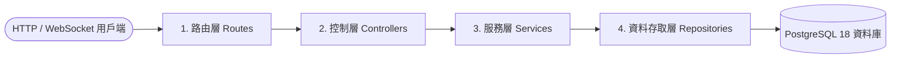

# Near Chat

[English](README.md) | 繁體中文

國立臺灣師範大學資料庫系統概論期末專案——即時文字通訊與群組聊天系統。本專案採 Monorepo 架構，結合 Next.js 前端、Node.js/Express 後端，以 Raw SQL 直接操作 PostgreSQL 進行高效查詢，並實現自訂群組權限、聊天分類資料夾、訊息生命週期，以及離線警報（遺言模式）等具體資料庫應用。

---

## 目錄

- [核心功能](#核心功能)
- [資料庫與架構設計](#資料庫與架構設計)
- [技術棧](#技術棧)
- [專案目錄結構](#專案目錄結構)
- [快速開始](#快速開始)
- [測試指令](#測試指令)

---

## 核心功能

1. **即時訊息與狀態**: 基於 Socket.IO 實現的即時單人與群組對話，包含動態在線狀態指示器。
2. **細粒度群組權限管理**:
   - 可自訂成員權限角色（`owner`、`admin`、`member`、`pending`）。
   - 包含禁言狀態 (`is_muted`)、聊天室別名、加入審核機制 (`require_approval`) 等功能。
   - 新成員可選擇性檢視聊天室歷史紀錄 (`view_history`)。
3. **遺言模式與緊急警報**:
   - 定期調度器會檢查使用者的 `last_activity` 活躍時間。
   - 當使用者離線天數超過設定的 `warning_days` 時，系統會自動向設定好的緊急聯絡人發送預設訊息。
4. **聊天分類資料夾**: 使用者可透過自訂資料夾分類聊天對話框（透過 `folders` 及 `folder_rooms` 關聯）。
5. **訊息生命週期控制**: 支援回覆訊息 (`reply_to_id`)、訊息收回 (`is_recalled`)、檔案附件關聯以及軟刪除機制 (`deleted_at`)。

## 資料庫與架構設計

### 後端分層架構

為確保程式碼的高可維護性與擴充性，後端專案嚴格落實四層分層架構設計：



1. **路由層 (Routes)**:
   定義 API 端點 (Endpoints)，並掛載 JWT 身份驗證、欄位格式驗證及限流等中間件。
2. **控制層 (Controllers)**:
   負責解析與提取請求參數 (`params`、`query`、`body`)，分發給服務層處理，並回傳標準化的 HTTP 回應格式。
3. **服務層 (Services)**:
   實作核心業務邏輯（如成員權限校驗、業務限制規則驗證），不與 Express 或 SQL 產生直接耦合。
4. **資料存取層 (Repositories)**:
   使用 raw SQL 語法，透過 `pg` 驅動直接與 PostgreSQL 資料庫進行讀寫操作。

## 技術棧

- **前端**: Next.js 16.2 (App Router), React 19, Tailwind CSS v4, Socket.IO Client。
- **後端**: Node.js, Express v5, Socket.IO, `pg` (PostgreSQL 原始驅動)。
- **資料庫**: PostgreSQL 18。
- **環境編排**: Docker 與 Docker Compose。
- **套件管理**: pnpm。

## 專案目錄結構

```text
.
├── backend/                # Express API 後端服務
│   ├── src/                # 後端 TypeScript 源碼 (routes, controllers, services, repositories)
│   ├── migrations/         # PostgreSQL node-pg-migrate 遷移腳本
│   └── Dockerfile          # 後端映像檔配置
├── frontend/               # Next.js 前端網頁應用
│   ├── app/                # React App Router 頁面與佈局
│   ├── components/         # 樣式與 UI 元件
│   └── Dockerfile          # 前端映像檔配置
├── shared/                 # 前後端共享 TypeScript 型別定義 (唯讀掛載)
├── docs/                   # 系統設計、開發指南、測試及 API 完整文檔
├── docker-compose.yml      # 本地多容器開發環境配置
└── README.md               # 專案概覽與索引
```

## 快速開始

詳細的開發說明文件請參考：[docs/DEVELOPMENT.md](docs/DEVELOPMENT.md)。

### 1. 複製環境變數範本
複製本地開發環境變數設定檔（預設值已完成配置，複製後即可直接使用）：
```bash
cp .env.example .env
```

### 2. 啟動服務容器
使用 Docker Compose 編譯並啟動所有服務：
```bash
docker compose up -d
```

### 附件上傳設定
附件上傳預設為不限制檔案類型，但預設仍有 `10 MB` 的容量上限。

如果你想啟用附件類型限制，請在 `.env` 中打開這個開關：

```env
ATTACHMENT_TYPE_RESTRICTION_ENABLED=true
```

當這個開關啟用後，後端會開始檢查 MIME type 白名單與副檔名白名單。專案在 `.env.example` 內提供了這組可直接參考的預設值：

```env
ATTACHMENT_ALLOWED_MIME_TYPES=image/jpeg,image/png,image/gif,application/pdf,application/zip,text/plain
ATTACHMENT_ALLOWED_EXTENSIONS=.jpg,.jpeg,.png,.gif,.pdf,.zip,.txt
ATTACHMENT_MAX_BYTES=10485760
```

你可以直接沿用這組設定，也可以依照自己的部署需求調整。當 `ATTACHMENT_TYPE_RESTRICTION_ENABLED=false` 時，這兩份白名單設定不會生效，附件仍會維持類型全開。

如果你有修改附件上傳相關環境變數，請重新建置或重啟 backend 容器，讓新設定生效：

```bash
docker compose up -d --build backend
```
後端容器啟動時會自動執行所有待執行的資料庫遷移，無需手動操作。

### 3. 匯入 mock 測試資料
執行 Seeding 腳本以建立測試用使用者：
```bash
docker compose exec backend pnpm run db:seed
```
*備註: Seeding 腳本會重置資料庫，並自動建立 6 位預設的使用者（如：`alice@test.com`，預設密碼為 `password123`）供開發測試。*

### 4. 服務連接埠對照表

| 服務名稱 | 訪問網址 | 描述 |
| :--- | :--- | :--- |
| **前端應用 (Frontend)** | [http://localhost:3005](http://localhost:3005) | 主 Next.js 網頁應用介面 |
| **後端服務 (Backend API)** | [http://localhost:4005](http://localhost:4005) | Express API 及 Socket.IO 伺服器 |
| **PostgreSQL 資料庫** | `localhost:5435` | PostgreSQL 18 資料庫 (容器內部對應 `5432` 連接埠) |

---

## 測試指令

請確保開發容器皆正常啟動，接著執行對應測試：

```bash
# 單元測試 (TypeScript 編譯與模擬測試)
docker compose exec backend pnpm run test:unit

# 整合測試 (啟動 docker-compose.test.yml 定義的暫時性資料庫進行測試)
docker compose exec backend pnpm run test:db:up
docker compose exec backend pnpm run test:integration
```
詳細測試規範請參閱 [docs/DEVELOPMENT.md](docs/DEVELOPMENT.md)。
