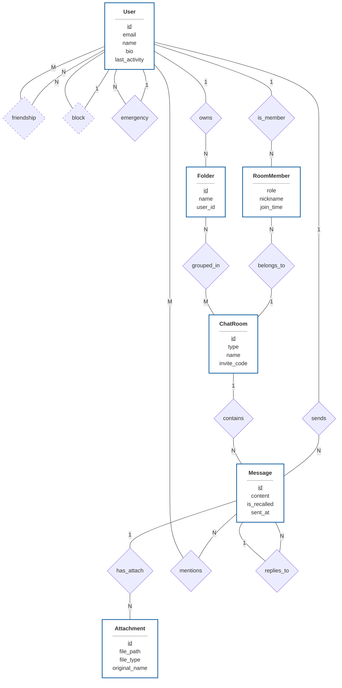

# Database Design Document

This document defines the database design, entity-relationship (ER) model, and relational schema for the real-time group chat application.

---

## 1. Professional ER-Diagram (Chen's Notation with Cardinality)

---

## 2. Entity & Relationship Specification

### A. Core Entities & Attributes
| Entity (實體) | Description (角色功能) | Attributes (屬性詳解) |
| :--- | :--- | :--- |
| **User** | 系統的核心使用者 | `id` (主鍵), `email` (唯一索引), `name` (姓名), `password_hash`, `bio`, `last_activity`, `warning_enabled`, `warning_days`, `deleted_at`, `lang_preference`, `app_theme`, `notify_desktop`, `notify_sound` |
| **ChatRoom** | 溝通的管道橋樑 | `id` (主鍵), `type` (私訊/群組), `name` (群組名稱), `avatar_url`, `invite_code` (唯一索引), `require_approval`, `view_history`, `is_archived`, `is_readonly` |
| **Message** | 系統主要資料流 | `id` (主鍵), `room_id` (外鍵), `sender_id` (外鍵), `content`, `reply_to_id` (遞迴外鍵), `is_recalled`, `sent_at` |
| **Folder** | 使用者端的聊天室分類 | `id` (主鍵), `user_id` (外鍵), `name` (資料夾名稱) |
| **Attachment** | 訊息中的檔案附件 | `id` (主鍵), `message_id` (外鍵), `uploaded_by` (外鍵), `file_path`, `file_type`, `original_name`, `uploaded_at` |

### B. Relationship & Cardinality Rules
1. **聊天室成員關係 (1:N:1)**:
   - `User (1) --- (N) RoomMember (N) --- (1) ChatRoom`
   - A user can be in multiple rooms; a chat room can have multiple members.
   - Roles include: **owner**, **admin**, **member**, **pending**.
2. **社交圖譜 (1:N 與 N:M)**:
   - **Friendship (N:M)**: Bidirectional friendship relationship between two users.
   - **Block (1:N)**: A user can block multiple other users.
   - **Emergency Contact (1:N)**: A user can designate multiple other users as emergency contacts.
3. **內容組織 (1:N 與 N:M)**:
   - **Folder Ownership (1:N)**: A user can own multiple folders.
   - **Folder Mapping (N:M)**: N:M mapping between folders and chat rooms (via join table).
   - **Messaging (1:N)**: A user sends many messages; a chat room contains many messages.
   - **Attachments (1:N)**: A message can have multiple file attachments.
   - **Mentions (N:M)**: A message can mention multiple users; a user can be mentioned in multiple messages.
   - **Replies (N:1)**: Messages can reply to a specific parent message (recursive reference).

---

## 3. Relational Schema Design (PostgreSQL 18)

### Core Entity Tables

#### `users` (使用者)
| Column Name | Type | Description | Constraints |
| :--- | :--- | :--- | :--- |
| `user_id` | UUID | Unique user identifier | PK, Default: `gen_random_uuid()` |
| `name` | VARCHAR(50) | Account username | UNIQUE, NOT NULL |
| `email` | VARCHAR(255) | Email address | UNIQUE, NOT NULL |
| `password_hash` | CHAR(60) | Bcrypt hash | NOT NULL |
| `bio` | TEXT | Self biography | |
| `avatar_url` | VARCHAR(255) | Profile image URL/path | |
| `warning_enabled`| BOOLEAN | Active emergency contact mode | NOT NULL, DEFAULT FALSE |
| `warning_days` | INT | Days of inactivity before alert; 0 to disable | NOT NULL, DEFAULT 0 |
| `last_activity` | TIMESTAMP | Last active timestamp | NOT NULL, DEFAULT CURRENT_TIMESTAMP |
| `created_at` | TIMESTAMP | User registration time | NOT NULL, DEFAULT CURRENT_TIMESTAMP |
| `deleted_at` | TIMESTAMP | Soft-delete timestamp | NULLABLE |
| `lang_preference`| VARCHAR(10)| Language preference (API field: `language`) | NOT NULL, DEFAULT 'en' |
| `app_theme` | VARCHAR(10)| UI theme preference (API field: `theme`) | NOT NULL, DEFAULT 'light', CHECK IN ('light', 'dark') |
| `notify_desktop` | BOOLEAN | Desktop notifications preference | NOT NULL, DEFAULT TRUE |
| `notify_sound` | BOOLEAN | Sound notification preference | NOT NULL, DEFAULT TRUE |

#### `chat_rooms` (聊天室)
| Column Name | Type | Description | Constraints |
| :--- | :--- | :--- | :--- |
| `room_id` | UUID | Unique chat room identifier | PK, Default: `gen_random_uuid()` |
| `type` | VARCHAR(10) | Room type (`private`, `group`) | NOT NULL |
| `name` | VARCHAR(100) | Group room name | NOT NULL for groups |
| `avatar_url` | VARCHAR(255) | Group room image | |
| `invite_code` | VARCHAR(20) | Unique invite join code | UNIQUE |
| `require_approval`| BOOLEAN | Request approval needed to join | DEFAULT FALSE |
| `view_history` | BOOLEAN | New members can see history | DEFAULT TRUE |
| `is_archived` | BOOLEAN | Is archived (becomes read-only) | NOT NULL, DEFAULT FALSE |
| `is_readonly` | BOOLEAN | Is read-only | NOT NULL, DEFAULT FALSE |
| `created_at` | TIMESTAMP | Creation time | NOT NULL, DEFAULT CURRENT_TIMESTAMP |

#### `messages` (訊息)
| Column Name | Type | Description | Constraints |
| :--- | :--- | :--- | :--- |
| `message_id` | UUID | Unique message identifier | PK, Default: `gen_random_uuid()` |
| `room_id` | UUID | Target chat room | FK(`chat_rooms`), NOT NULL |
| `sender_id` | UUID | Message sender | FK(`users`), SET NULL on account delete |
| `content` | TEXT | Text content | NOT NULL |
| `reply_to_id` | UUID | Replied message ID | FK(`messages`) |
| `is_recalled` | BOOLEAN | If message has been recalled | DEFAULT FALSE |
| `sent_at` | TIMESTAMP | Sent timestamp | NOT NULL, DEFAULT CURRENT_TIMESTAMP |

#### `attachments` (附件)
| Column Name | Type | Description | Constraints |
| :--- | :--- | :--- | :--- |
| `attachment_id` | UUID | Unique attachment identifier | PK, Default: `gen_random_uuid()` |
| `message_id` | UUID | Associated message ID | FK(`messages`), CASCADE DELETE |
| `uploaded_by` | UUID | Uploader ID | FK(`users`), SET NULL |
| `file_path` | VARCHAR(255) | Storage file path | NOT NULL |
| `file_type` | VARCHAR(50) | MIME type | NOT NULL |
| `original_name` | VARCHAR(255) | Original uploaded file name | NOT NULL |
| `uploaded_at` | TIMESTAMP | Uploaded timestamp | NOT NULL, DEFAULT CURRENT_TIMESTAMP |

---

### Relationship & Helper Tables

#### `room_members` (聊天室成員)
| Column Name | Type | Description | Constraints |
| :--- | :--- | :--- | :--- |
| `room_id` | UUID | Associated room | PK, FK(`chat_rooms`), CASCADE DELETE |
| `user_id` | UUID | Member user | PK, FK(`users`), CASCADE DELETE |
| `role` | VARCHAR(20) | Member role (`owner`, `admin`, `member`, `pending`) | NOT NULL, DEFAULT 'member' |
| `nickname` | VARCHAR(50) | Nickname in this room | |
| `is_muted` | BOOLEAN | Muted status | DEFAULT FALSE |
| `last_read_id` | UUID | ID of last read message | FK(`messages`) |
| `join_time` | TIMESTAMP | Join timestamp | NOT NULL, DEFAULT CURRENT_TIMESTAMP |

#### `friendships` (好友關係)
| Column Name | Type | Description | Constraints |
| :--- | :--- | :--- | :--- |
| `requester_id` | UUID | User sending the invite | PK, FK(`users`), CASCADE DELETE |
| `addressee_id` | UUID | User receiving the invite | PK, FK(`users`), CASCADE DELETE |
| `status` | VARCHAR(20) | Friendship status (`pending`, `accepted`) | NOT NULL |
| `created_at` | TIMESTAMP | Invitation creation timestamp | NOT NULL, DEFAULT CURRENT_TIMESTAMP |

#### `blocks` (封鎖關係)
| Column Name | Type | Description | Constraints |
| :--- | :--- | :--- | :--- |
| `blocker_id` | UUID | Blocker user ID | PK, FK(`users`), CASCADE DELETE |
| `blocked_id` | UUID | Blocked user ID | PK, FK(`users`), CASCADE DELETE |
| `created_at` | TIMESTAMP | Block timestamp | NOT NULL, DEFAULT CURRENT_TIMESTAMP |

#### `folders` (分類資料夾)
| Column Name | Type | Description | Constraints |
| :--- | :--- | :--- | :--- |
| `folder_id` | UUID | Unique folder identifier | PK, Default: `gen_random_uuid()` |
| `user_id` | UUID | Owner user ID | FK(`users`), CASCADE DELETE, NOT NULL |
| `name` | VARCHAR(50) | Folder name | NOT NULL |
| `created_at` | TIMESTAMP | Folder creation timestamp | NOT NULL, DEFAULT CURRENT_TIMESTAMP |

#### `folder_rooms` (資料夾內容)
| Column Name | Type | Description | Constraints |
| :--- | :--- | :--- | :--- |
| `folder_id` | UUID | Folder ID | PK, FK(`folders`), CASCADE DELETE |
| `room_id` | UUID | Room ID | PK, FK(`chat_rooms`), CASCADE DELETE |
| `user_id` | UUID | Owner ID for scoping uniqueness | FK(`users`), NOT NULL |
| `UNIQUE(user_id, room_id)` | | Restricts room to one folder per user | |

#### `emergency_contacts` (緊急聯絡)
| Column Name | Type | Description | Constraints |
| :--- | :--- | :--- | :--- |
| `user_id` | UUID | Account owner | PK, FK(`users`), CASCADE DELETE |
| `contact_id` | UUID | Contact user | PK, FK(`users`), CASCADE DELETE |
| `message` | TEXT | Message template to send | NOT NULL |
| `created_at` | TIMESTAMP | Configuration timestamp | NOT NULL, DEFAULT CURRENT_TIMESTAMP |

#### `message_mentions` (訊息提及)
| Column Name | Type | Description | Constraints |
| :--- | :--- | :--- | :--- |
| `message_id` | UUID | Message ID | PK, FK(`messages`), CASCADE DELETE |
| `user_id` | UUID | Mentioned user ID | PK, FK(`users`), CASCADE DELETE |

#### `refresh_tokens` (更新權杖)
| Column Name | Type | Description | Constraints |
| :--- | :--- | :--- | :--- |
| `token_id` | UUID | Token identifier | PK, Default: `gen_random_uuid()` |
| `user_id` | UUID | User ID | FK(`users`), CASCADE DELETE, NOT NULL |
| `token_hash` | VARCHAR(255) | Token hash value | UNIQUE, NOT NULL |
| `expires_at` | TIMESTAMPTZ | Expiry time | NOT NULL |
| `created_at` | TIMESTAMPTZ | Creation time | NOT NULL, DEFAULT CURRENT_TIMESTAMP |
| `revoked_at` | TIMESTAMPTZ | Revoked time | NULLABLE |
| `replaced_by` | UUID | New token ID that replaced this one | FK(`refresh_tokens`), SET NULL |

#### `emergency_alert_logs` (緊急警報日誌)
| Column Name | Type | Description | Constraints |
| :--- | :--- | :--- | :--- |
| `user_id` | UUID | User ID | PK, FK(`users`), CASCADE DELETE |
| `last_activity_at`| TIMESTAMPTZ| Last activity time | PK, NOT NULL |
| `alerted_at` | TIMESTAMPTZ | Alert triggered timestamp | NOT NULL, DEFAULT CURRENT_TIMESTAMP |

---

## 4. Key Business Logic Rules

* **Private Room Rules**:
  - `private` rooms must be strictly 1-on-1; groups (`group` type) should be used for 3+ members.
  - Only a single `private` room can exist between any two users. The "send message" flow uses "open or create private room" semantics: reuses the existing private room if it exists, otherwise creates a new one.
  - A database-level/transaction guard must ensure no duplicate private rooms are created under concurrent requests.
* **Archive & Read-Only**:
  - `is_archived = true` sets a room as archived. Historically stored messages remain readable, but sending new messages is blocked.
* **Attachments Relationship**:
  - `attachments` table uses a many-to-one relationship with `messages`. A file upload can be initially created without a `message_id`, then bound to a message upon sending. Once bound, it cannot be linked to another message.
* **Soft Deletes**:
  - System soft deletes users using the `deleted_at` field. This ensures historical messages can display sender metadata properly (e.g. "Deleted User") rather than breaking message feeds.
* **Emergency Alert System**:
  - Periodically compares user `last_activity` with `warning_days` (if `warning_enabled`). If the inactivity window is breached, an alert log is created and predefined messages are dispatched to their emergency contacts.

---

## 5. Future Extensions: End-to-End Encryption Scope

End-to-end (E2E) encryption is **out of scope** for the current v1 release.

### Current v1 plain-text behavior:
- Backend persists message text in raw plaintext inside `messages.content`.
- REST APIs and WebSockets transmit raw plaintext message payloads.
- Attachments are stored as unencrypted files in container storage (`/app/uploads/`).
- Database searches, mentions, and validation routines read plaintext directly.

### Prerequisites for future E2E implementation:
If E2E encryption is integrated in future updates:
1. **Key Management**: Client-generated key pairs, room key derivation/exchange protocols, backup keys, and recovery mechanics must be designed.
2. **Encrypted Payload Shape**: Modify the `messages.content` schema or use a structured container holding the ciphertext, IV/nonce, encryption parameters, and key reference.
3. **Attachments**: Clients must encrypt attachments prior to uploading them, and serve key indicators separately to authorize download decryption.
4. **Search Capability**: Backend-side message indexing will become impossible. Search functionality must run completely client-side.
