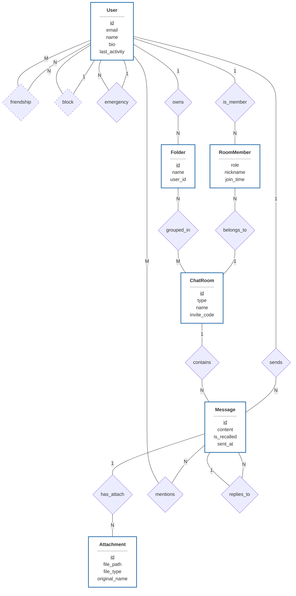

# Project Database Design Document (ER-Diagram)

## 1. Professional ER-Diagram (Chen's Notation with Cardinality)

---

## 2. 詳細設計規格說明

### A. 核心實體與屬性定義
| 實體 (Entity) | 角色功能 | 屬性詳解 |
| :--- | :--- | :--- |
| **User** | 系統的核心使用者 | `id` (主鍵), `email` (唯一索引), `name` (姓名), `password_hash`, `bio`, `last_activity`, `warning_enabled`, `warning_days`, `deleted_at`, `lang_preference`, `app_theme`, `notify_desktop`, `notify_sound` |
| **ChatRoom** | 溝通的管道橋樑 | `id` (主鍵), `type` (私訊/群組), `name` (群組名稱), `avatar_url`, `invite_code` (唯一索引), `require_approval`, `view_history`, `is_archived`, `is_readonly` |
| **Message** | 系統主要資料流 | `id` (主鍵), `room_id` (外鍵), `sender_id` (外鍵), `content`, `reply_to_id` (遞迴外鍵), `is_recalled`, `sent_at` |
| **Folder** | 使用者端的聊天室分類 | `id` (主鍵), `user_id` (外鍵), `name` (資料夾名稱) |
| **Attachment** | 訊息中的檔案附件 | `id` (主鍵), `message_id` (外鍵), `uploaded_by` (外鍵), `file_path`, `file_type`, `original_name`, `uploaded_at` |

### B. 關係邏輯與基數 (Cardinality) 說明
1.  **聊天室成員關係 (1:N:1)**:
    *   `User (1) --- (N) RoomMember (N) --- (1) ChatRoom`。
    *   一位使用者可擁有數個成員身分，一個聊天室擁有多位成員。
    *   **定義身份**: **Owner**, **Admin**, **Member**, **Pending**。

2.  **社交圖譜 (1:N 與 N:M)**:
    *   **Friendship (N:M)**：多位使用者與多位使用者間的雙向好友關係。
    *   **Block (1:N)**：一位使用者可以封鎖多位對象。
    *   **EmergencyContact (1:N)**：一位使用者可以指定多位緊急聯絡人。

3.  **內容組織 (1:N 與 N:M)**:
    *   **Folder Ownership (1:N)**：一位使用者擁候多個資料夾。
    *   **Folder Mapping (N:M)**：資料夾與聊天室間的多對多關聯（透過中介表）。
    *   **Messaging (1:N)**：一位使用者發送多則訊息；一個聊天室包含多則訊息。
    *   **Attachments (1:N)**：一則訊息可夾帶多個附件檔案。
    *   **Mentions (N:M)**：一則訊息可標記多位使用者；一位使用者可在多則訊息中被標記。
    *   **Replies (N:1)**：多則訊息可以回覆同一則特定訊息（遞迴關係）。

### C. 進階架構完整性
*   **私隱唯一性 (Privacy Uniqueness)**：系統在建立私聊前會先透過 `findPrivateRoomByMembers(userA, userB)` 檢查是否已存在兩者之間的私訊聊天室，並在 `friendships` 狀態變更時自動建立或重新啟用私訊，以防止重複建立私聊。
*   **資料持久化**: 透過 `User.deleted_at` 實施軟刪除（Soft-delete），確保即使帳號移除後，訊息審計追蹤與歷史脈絡仍能完整保留。
*   **安全自動化**: 系統任務會定期對照 `last_activity` 與 `warning_days`（即遺言模式天數），若超過設定期限則觸發 `緊急聯絡` 的通知程序。
