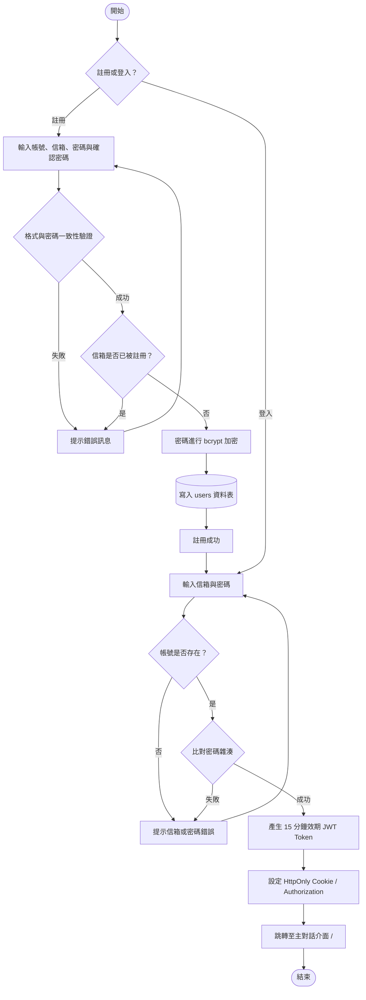
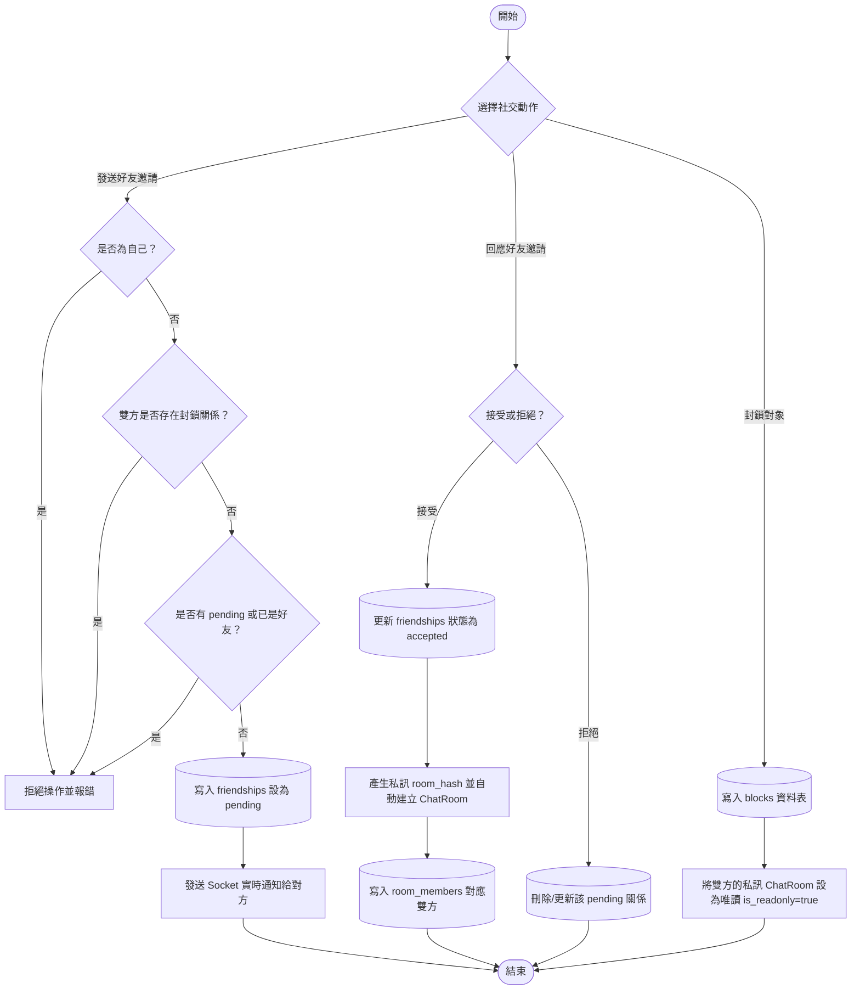
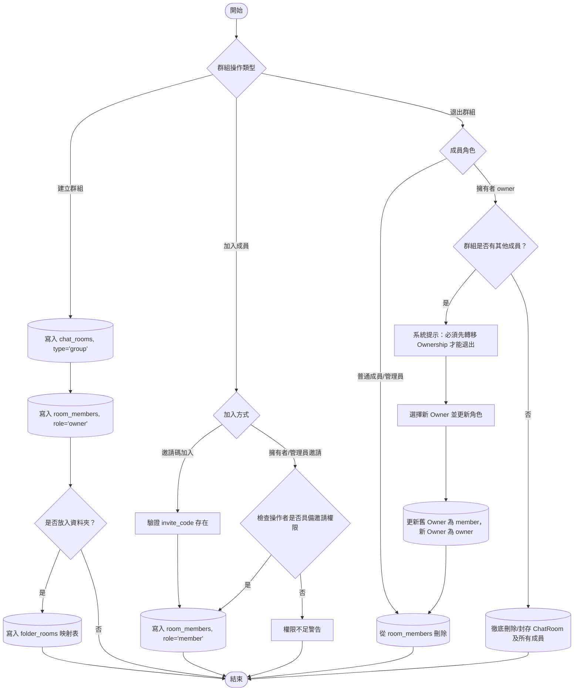
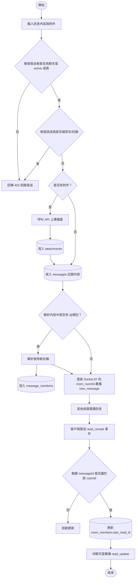
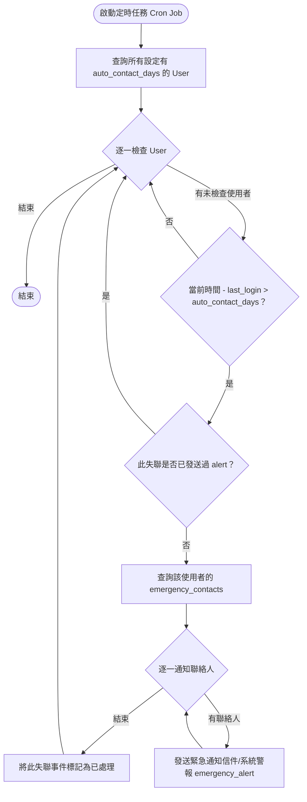

# Project Report 3
第 9 組
組員：江禹叡、楊銘煌、趙偉恆、姚承希

本報告旨在規劃與說明 1142-ntnu-db-app 專案的系統功能、實作規劃與資料庫連結技術。

---
## 一、ER-digram

### 修改
- RoomMember 改為關係
- send 改為與 User, ChatRoom 兩表 aggregation 的關係

## 二、 E-R diagram 轉成 Relational Table 之 DDL 的形式

本章節定義將 E-R Model 轉換成實體關聯式資料庫 (Relational Database) 之後的詳細表格架構。

### 1. 核心實體表

#### users (使用者)
| 欄位名 | 型別 | 說明 | 限制 |
| :--- | :--- | :--- | :--- |
| user_id | UUID | 使用者唯一識別碼 | PK, Default: gen_random_uuid() |
| name | VARCHAR(50) | 帳號名稱 | UNIQUE, NOT NULL |
| email | VARCHAR(255) | 電子信箱 | UNIQUE, NOT NULL |
| password_hash | CHAR(60) | 雜湊密碼 (bcrypt) | NOT NULL |
| bio | TEXT | 個人簡介 | |
| avatar_url | VARCHAR(255) | 頭像路徑 | |
| warning_enabled | BOOLEAN | 是否開啟遺言模式 | NOT NULL, DEFAULT FALSE |
| warning_days | INT | 觸發遺言的天數；`0` 代表關閉 | NOT NULL, DEFAULT 0 |
| last_activity | TIMESTAMP | 最後活躍時間 | NOT NULL, DEFAULT CURRENT_TIMESTAMP |
| created_at | TIMESTAMP | 註冊時間 | NOT NULL, DEFAULT CURRENT_TIMESTAMP |
| deleted_at | TIMESTAMP | 軟刪除時間 | NULLABLE |
| lang_preference | VARCHAR(10) | 語言偏好（對外 API 欄位名為 `language`） | NOT NULL, DEFAULT 'en' |
| app_theme | VARCHAR(10) | UI 主題偏好（對外 API 欄位名為 `theme`） | NOT NULL, DEFAULT 'light', CHECK IN ('light', 'dark') |
| notify_desktop | BOOLEAN | 桌面通知偏好（對外 API 欄位名為 `notifyDesktop`） | NOT NULL, DEFAULT TRUE |
| notify_sound | BOOLEAN | 訊息音效偏好（對外 API 欄位名為 `notifySound`） | NOT NULL, DEFAULT TRUE |

#### chat_rooms (聊天室)
| 欄位名 | 型別 | 說明 | 限制 |
| :--- | :--- | :--- | :--- |
| room_id | UUID | 聊天室唯一識別碼 | PK, Default: gen_random_uuid() |
| type | VARCHAR(10) | 類型 ('private', 'group') | NOT NULL |
| name | VARCHAR(100) | 群組名稱 | (群組時 NOT NULL) |
| avatar_url | VARCHAR(255) | 群組頭像 | |
| invite_code | VARCHAR(20) | 群組邀請代碼 | UNIQUE |
| require_approval | BOOLEAN | 加入是否須審核 | DEFAULT FALSE |
| view_history | BOOLEAN | 新成員可見歷史訊息 | DEFAULT TRUE |
| is_archived | BOOLEAN | 是否已封存（封存後唯讀） | NOT NULL, DEFAULT FALSE |
| created_at | TIMESTAMP | 建立時間 | NOT NULL, DEFAULT CURRENT_TIMESTAMP |

#### messages (訊息)
| 欄位名 | 型別 | 說明 | 限制 |
| :--- | :--- | :--- | :--- |
| message_id | UUID | 訊息唯一識別碼 | PK, Default: gen_random_uuid() |
| room_id | UUID | 所屬聊天室 | FK(chat_rooms), NOT NULL |
| sender_id | UUID | 發送者 | FK(users), SET NULL (若帳號刪除) |
| content | TEXT | 訊息內容 | NOT NULL |
| reply_to_id | UUID | 回覆的訊息 ID | FK(messages) |
| is_recalled | BOOLEAN | 是否已被收回 | DEFAULT FALSE |
| sent_at | TIMESTAMP | 發送時間 | NOT NULL, DEFAULT CURRENT_TIMESTAMP |

#### attachments (附件)
| 欄位名 | 型別 | 說明 | 限制 |
| :--- | :--- | :--- | :--- |
| attachment_id | UUID | 附件唯一識別碼 | PK, Default: gen_random_uuid() |
| message_id | UUID | 所屬訊息；未綁定前可為空，綁定後只屬於單一訊息 | FK(messages), CASCADE DELETE |
| uploaded_by | UUID | 上傳者 | FK(users), SET NULL |
| file_path | VARCHAR(255) | 儲存路徑 | NOT NULL |
| file_type | VARCHAR(50) | MIME type | NOT NULL |
| original_name | VARCHAR(255) | 原始檔名 | NOT NULL |
| uploaded_at | TIMESTAMP | 上傳時間 | NOT NULL, DEFAULT CURRENT_TIMESTAMP |

### 2. 關係與弱實體表

#### room_members (聊天室成員)
| 欄位名 | 型別 | 說明 | 限制 |
| :--- | :--- | :--- | :--- |
| room_id | UUID | 聊天室 ID | PK, FK(chat_rooms), CASCADE DELETE |
| user_id | UUID | 使用者 ID | PK, FK(users), CASCADE DELETE |
| role | VARCHAR(20) | 角色 ('owner', 'admin', 'member', 'pending') | NOT NULL, DEFAULT 'member' |
| nickname | VARCHAR(50) | 在該室的暱稱 | |
| is_muted | BOOLEAN | 是否被禁言 | DEFAULT FALSE |
| last_read_id | UUID | 最後已讀訊息 ID | FK(messages) |
| join_time | TIMESTAMP | 加入時間 | NOT NULL, DEFAULT CURRENT_TIMESTAMP |

#### friendships (好友關係)
| 欄位名 | 型別 | 說明 | 限制 |
| :--- | :--- | :--- | :--- |
| requester_id | UUID | 發送邀請者 | PK, FK(users), CASCADE DELETE |
| addressee_id | UUID | 接受邀請者 | PK, FK(users), CASCADE DELETE |
| status | VARCHAR(20) | 狀態 ('pending', 'accepted') | NOT NULL |
| created_at | TIMESTAMP | 建立時間 | NOT NULL, DEFAULT CURRENT_TIMESTAMP |

#### blocks (封鎖關係)
| 欄位名 | 型別 | 說明 | 限制 |
| :--- | :--- | :--- | :--- |
| blocker_id | UUID | 封鎖者 | PK, FK(users), CASCADE DELETE |
| blocked_id | UUID | 被封鎖者 | PK, FK(users), CASCADE DELETE |
| created_at | TIMESTAMP | 封鎖時間 | NOT NULL, DEFAULT CURRENT_TIMESTAMP |

#### folders (分類資料夾)
| 欄位名 | 型別 | 說明 | 限制 |
| :--- | :--- | :--- | :--- |
| folder_id | UUID | 資料夾唯一識別碼 | PK, Default: gen_random_uuid() |
| user_id | UUID | 擁有者 | FK(users), CASCADE DELETE, NOT NULL |
| name | VARCHAR(50) | 資料夾名稱 | NOT NULL |
| created_at | TIMESTAMP | 建立時間 | NOT NULL, DEFAULT CURRENT_TIMESTAMP |

#### folder_rooms (資料夾內容)
| 欄位名 | 型別 | 說明 | 限制 |
| :--- | :--- | :--- | :--- |
| folder_id | UUID | 資料夾 ID | PK, FK(folders), CASCADE DELETE |
| room_id | UUID | 聊天室 ID | PK, FK(chat_rooms), CASCADE DELETE |
| user_id | UUID | 使用者 ID (用於限制唯一性) | FK(users), NOT NULL |
| UNIQUE(user_id, room_id) | | 確保同一使用者不能把同一房間放進兩個資料夾 | |

#### emergency_contacts (緊急聯絡)
| 欄位名 | 型別 | 說明 | 限制 |
| :--- | :--- | :--- | :--- |
| user_id | UUID | 委託人 | PK, FK(users), CASCADE DELETE |
| contact_id | UUID | 緊急聯絡人 | PK, FK(users), CASCADE DELETE |
| message | TEXT | 預設發送訊息 | NOT NULL |
| created_at | TIMESTAMP | 設定時間 | NOT NULL, DEFAULT CURRENT_TIMESTAMP |

#### message_mentions (訊息提及)
| 欄位名 | 型別 | 說明 | 限制 |
| :--- | :--- | :--- | :--- |
| message_id | UUID | 訊息 ID | PK, FK(messages), CASCADE DELETE |
| user_id | UUID | 被提及者 ID | PK, FK(users), CASCADE DELETE |

### 3. 業務規則

- `private` 聊天室僅限一對一；若需三人以上對話，必須建立 `group`。
- 同一對使用者只允許存在一個 `private` 聊天室。好友列表中的「傳送訊息」應採用「開啟或建立私聊」語意：已有私聊則直接使用，沒有才建立。
- 需要有資料庫或其他後端層級的唯一性保證，避免雙方同時操作時重複建立 `private` 聊天室。
- `is_archived = true` 表示聊天室已封存，封存後保留歷史資料，但不可再發送新訊息。
- `attachments` 與 `messages` 的關係為多對一：單一附件最終只屬於一則訊息，但一則訊息可擁意多個附件。

## 三、 系統內容功能詳細敘述

### 1. 帳號身分驗證與個人設定
- **使用者註冊與登入**：使用者可透過電子郵件與密碼進行註冊。系統在寫入資料庫時，會使用 `bcrypt` 演算法將密碼進行高強度雜湊加密，以確保即使資料庫外洩，密碼也無法被還原。登入時驗證密碼，驗證成功後系統會核發 15 分鐘效期的 JSON Web Token (JWT)，以 `HttpOnly` Cookie 形式傳送給瀏覽器，防止跨站腳本攻擊 (XSS)。
- **個人資料管理**：使用者可修改個人顯示名稱、個人簡介 (bio)、更換頭像 (avatar) 以及變更密碼。
- **遺言模式**：使用者可啟用此模式，自訂允許未上線的最大天數以及多名緊急聯絡人，當使用者超過設定天數未活躍，系統會發出警報。

### 2. 好友與社交關係管理
- **好友申請**：使用者可透過搜尋名稱或 ID 發送好友邀請。被邀請者可以接受或拒絕邀請。
- **好友建立**：被邀請者接受後，系統會將好友關係更新為 `accepted`，同時自動為兩位使用者生成一對唯一的 `room_hash` 值，以避免重複建立私訊聊天室，並在資料庫中自動建立該私訊聊天室及加入雙方為成員。
- **單向封鎖機制**：使用者可以封鎖其他使用者。封鎖後，被封鎖者將無法向封鎖者發送訊息，且雙方的私訊聊天室會被設定為唯讀狀態。

### 3. 聊天室與群組管理
本系統將聊天室區分為私訊與群組兩類，並提供多層級權限控制：
- **群組身分角色等級**：
  - **擁有者**：一個群組有且僅有一位 Owner。 Owner 擁有最高權限，可更改群組設定、管理所有成員角色、封存或刪除群組。Owner 若要退出群組，必須先指派並移交給另一位成員，防止群組產生無主狀態。
  - **管理員**：輔助 Owner 管理群組。可更改其他成員的群組暱稱、設定新成員是否可見加入前歷史訊息、將違規成員禁言、踢出一般成員、刪除違規訊息，以及審核新成員加入申請。
  - **一般成員**：可於聊天室內傳送訊息、分享邀請碼與邀請連結。
  - **待審核**：若群組開啟了審核機制，新加入的成員會先處於此狀態，待 Admin 或 Owner 核准後才能正式加入聊天。
- **群組設定**：包括群組名稱、圖像、是否為公開群組（允許任何人透過代碼加入）、是否開啟審核機制、以及新加入成員是否可查看加入前的歷史訊息。

### 4. 實時訊息與多媒體互動
- **實時訊息傳輸**：基於 socket.io 套件進行雙向即時通訊。訊息一經發送，即時廣播給該聊天室內所有線上成員。
- **訊息回覆與收回**：
  - **回覆**：使用者可指定回覆某一則特定訊息，並在 UI 上以引用或對話樹呈現。
  - **收回**：發送者可收回自己發送的訊息，收回後會顯示「此訊息以被收回」。
- **提及標記**：支援以 `@使用者名稱` 提及聊天室成員，發送時系統自動解析並記錄提及關聯，以利在前端提示被提及的使用者。
- **附件**：支援上傳圖片或檔案作為訊息附件。檔案經由專屬 API 上傳至後端伺服器，並在 `attachments` 資料表中建立對應的檔案路徑、原始檔名與大小紀錄。
- **已讀標示機制**：水位線機制。資料庫記錄每個成員在特定聊天室讀取到的最後一則 message_id，每當使用者閱讀訊息時即時觸發 Socket 事件更新，並在前端計算精確的未讀訊息數量。

### 5. 聊天室資料夾分類
- 使用者可在側邊欄建立自訂資料夾（如「學術討論」、「休閒生活」、「工作組別」），並將不同的私聊或群組聊天室拖曳或加入至特定資料夾中進行分類收納，解決聊天室眾多時造成的雜亂問題。

---

## 四、 系統功能實作規劃

### 1. 核心業務流程圖 (Core Business Flowcharts)

本系統之關鍵業務邏輯規劃如下，詳細揭示了從前端操作、API 控制器、服務邏輯至資料庫 (PostgreSQL) 存取的完整流向：

#### A. 身分驗證與註冊流程

#### B. 好友社交與封鎖邏輯流程

#### C. 聊天室與群組生命週期流程

#### D. 實時訊息發送與讀取狀態流程

#### E. 安全自動聯絡與緊急狀態流

### 2. 介面設計規劃

本系統介面遵循 **Border UI (線框極簡主義)** 視覺規範設計，強調高對比度、清晰的 1px 實線網格分割與資訊密度，完全摒棄漸層與陰影：

- **A. 登入與註冊頁面 (Login & Register Pages)**
  - 卡片式線框佈局。包含 Email 欄位、密碼欄位、以及極簡的 `checkbox`（記住我）。
  - 按鈕採用實色填充，在 Hover 或 Pressed 時進行 border 顏色切換或 1px 的位移微互動。
- **B. 主介面 (Main Dashboard Page)**
  - 採三欄式橫向網格設計（以單一 1px 實線劃分各區塊，無額外留白間距）：
    - **左側導覽欄 (Sidebar)**：顯示應用程式 Logo、聊天室分類資料夾（以折疊面板收納）、聊天室列表（顯示頭像、聊天室名稱、最後一則訊息與未讀計數），以及最下方的個人頭像、個人設定按鈕與登出按鈕。
    - **中間主對話欄 (Chat Panel)**：
      - 頂部：顯示目前聊天室名稱與設定按鈕（若為群組則有管理按鈕）。
      - 中部：訊息時間軸。訊息泡泡為矩形線框（白底黑框代表對方發送，淡灰底或藍框代表己方發送），支援顯示回覆引用內容、提及高亮標記、以及附件下載按鈕。
      - 底部：固定於底部的輸入欄。包含附件上傳圖示按鈕、文字輸入區與發送按鈕。
    - **右側成員欄 (Group Member List)**：僅在群組聊天室開啟。展示目前群組內所有成員的名單與其角色標章（如 `owner`, `admin`），並提供管理員對成員禁言、踢除的操作按鈕。
- **C. 設定頁面 (Settings Page)**
  - 獨立的大型卡片區塊，分成個人資料（顯示名稱、簡介、頭像變更）、外觀與語言設定（明暗主題切換、繁中/英文切換）以及安全性（密碼修改、自動聯絡天數與緊急聯絡人增刪）。

### 3. 連結資料庫與分層實作技術 (Database Connection & Implementation Technologies)

為了兼顧資料庫操作的透明度、查詢優化、以及高併發效能，本專案採用以下技術進行資料庫連結與後端架構開發：

#### A. 資料庫連線、操作
- 使用 Node.js PostgreSQL 官方客戶端 `pg` 驅動，在 `src/db.ts` 中建立共享的 `pg.Pool` 連線池。透過連線池管理機制（設定最大連線數、閒置釋放時間），可高併發地複用資料庫連線，降低頻繁建立連線所產生的 TCP 握手延遲。
- 所有資料異動一律以參數化 SQL（例如 `INSERT INTO users (username) VALUES ($1)`）傳遞，將 SQL 程式碼與用戶輸入資料分離，由 PostgreSQL 引擎進行預編譯與安全轉義，**杜絕 SQL 注入攻擊**。

#### B. 資料庫版本控制與遷移管理 (Database Migrations)
- 使用 `node-pg-migrate` 進行資料庫 Schema 的升級與降級。所有資料表的建立、修改（如新增 `room_hash` 索引、外鍵級聯刪除）皆以 SQL Migration 檔案進行版本管理，確保開發、測試與生產環境的資料庫結構完全一致。

#### C. 後端分層架構設計 (Layered Architecture Integration)
後端軟體架構嚴格拆分為四層，以落實單一職責原則（SRP）並提高程式碼的可測試性：
1. **路由層 (Routes)**：定義 REST API 的 Endpoints（如 `POST /api/v1/messages`）。掛載 `authMiddleware`（校驗 JWT Cookie）與 Zod 驗證中間件（攔截格式不符的請求），只讓合法的 Request 傳遞至 Controller。
2. **控制層 (Controllers)**：不包含業務邏輯與 SQL。僅負責從 `req` 提取參數（如發送者 ID、聊天室 ID）、調用對應的 Service，並根據執行結果分配 HTTP 狀態碼回傳 JSON 格式（例如成功刪除回傳 `204 No Content`，錯誤則交由 `errorHandler` 中間件捕獲）。
3. **服務邏輯層 (Services)**：系統的核心邏輯控制點。包含禁言狀態驗證、房間成員身分檢查、封鎖狀態確認等。在所有規則校驗通過後，才會呼叫 Repository 執行資料庫讀寫。
4. **資料存取層 (Repositories)**：專注於資料庫 SQL 操作。例如，在分頁查詢 `MessageRepository.findByRoom` 中，採用複合游標 `(sent_at DESC, message_id DESC)` 取代單一 timestamp 分頁，解決了高併發多人在同一微秒發送訊息時導致的分頁漏訊息問題。

#### D. 實時 Socket 與資料庫寫入協同 (Socket-DB Synergy)
- 當 Socket.IO 伺服器接收到發訊事件時，會調用後端分層中的 Service 與 Repository 將訊息持久化至 PostgreSQL。
- 寫入成功後，即時取出附帶主鍵 `message_id` 的完整資料結構，透過網頁通訊協定廣播至該房間的 Socket 通道（`io.to(room_roomId).emit(...)`），確保客戶端在收到新訊息的同時能取得正確的資料庫狀態（如已編號的訊息 ID、正確的發送時間戳記）。

## 五、分工
- 楊銘煌：前端界面設計、好友功能、docker 維護
- 姚承希：前端架構、聊天室
- 趙偉恆：使用者帳號、緊急聯絡功能
- 江禹叡：後端伺服器架構、聊天訊息
