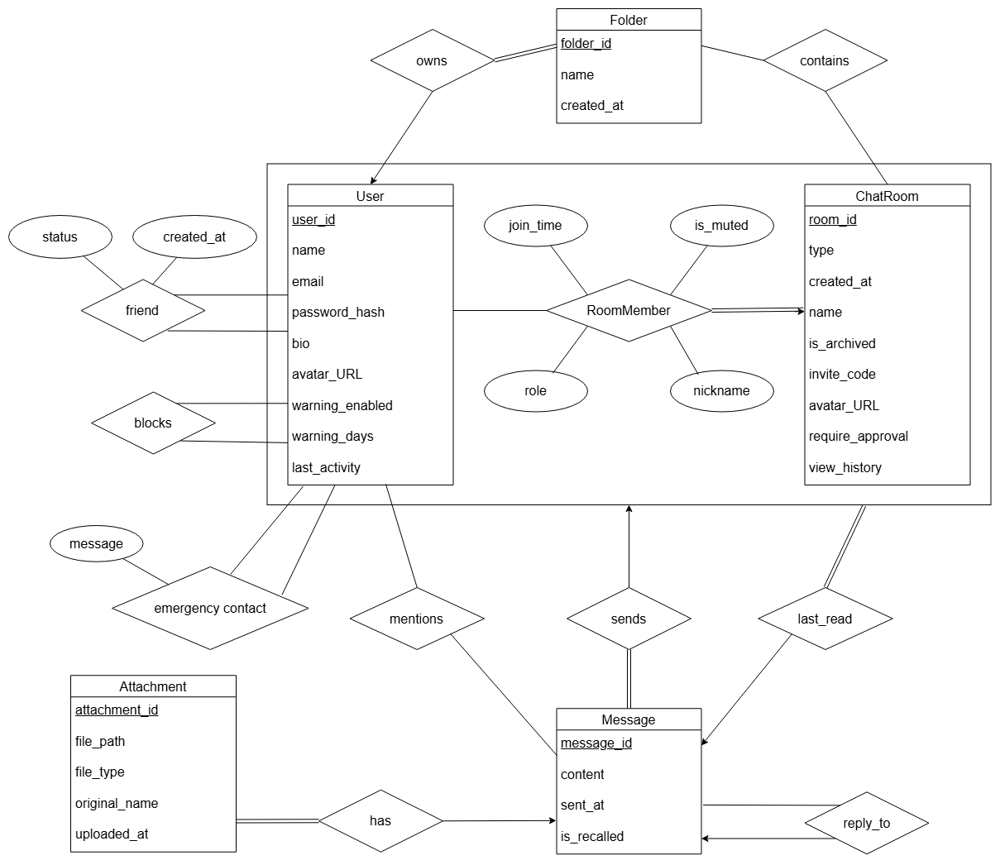
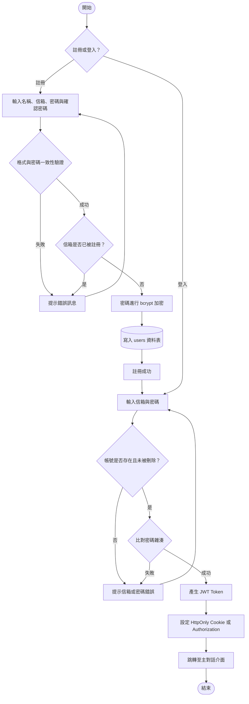
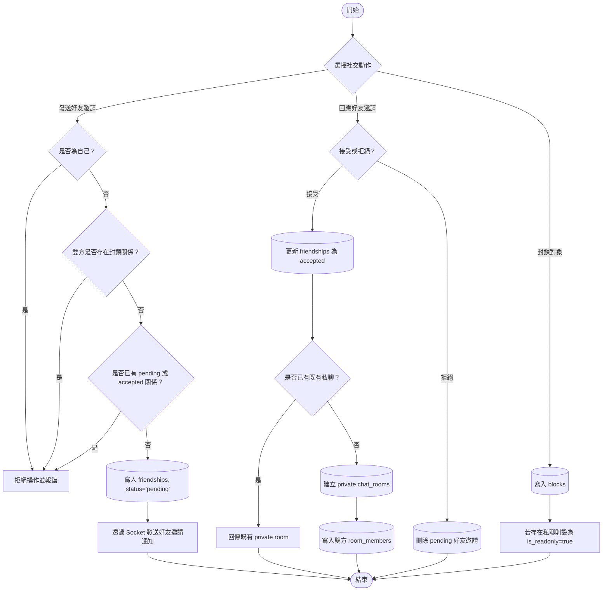
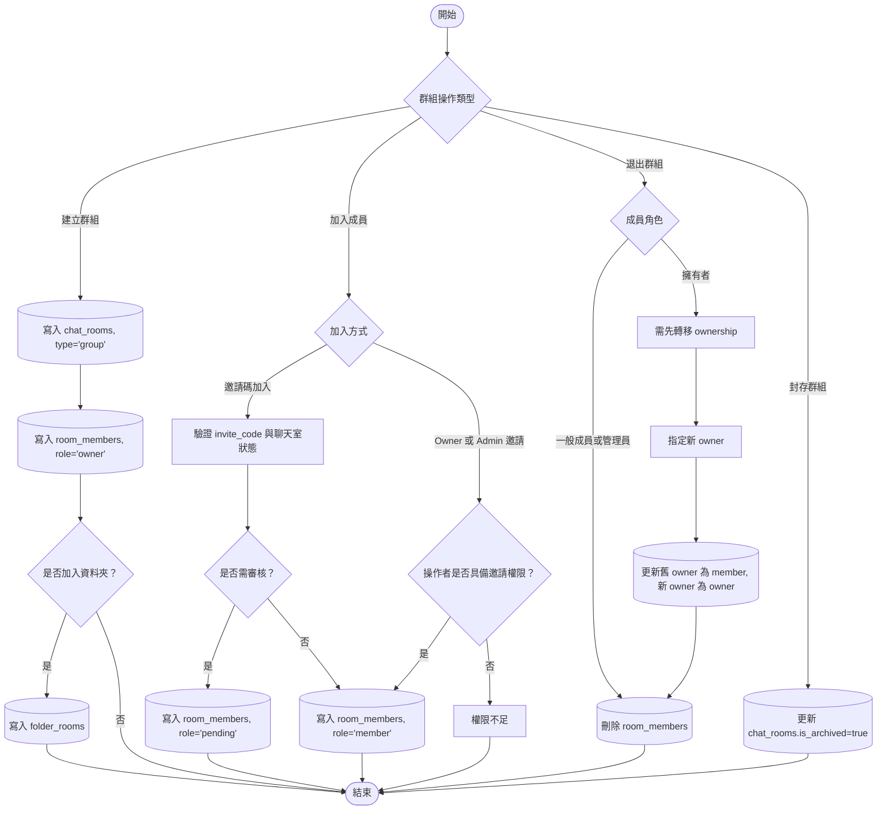
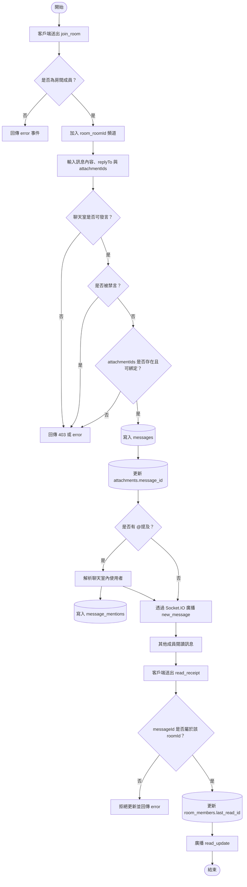
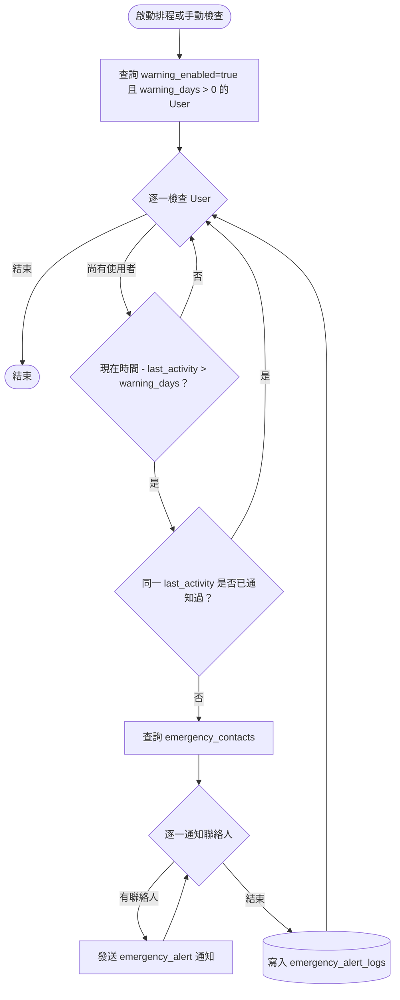

# Project Report 3
第 9 組

組員：江禹叡、楊銘煌、趙偉恆、姚承希

## 一、ER-diagram



### E-R diagram 說明

本版 E-R diagram 為在 `Report 2` 基礎上修正後的版本，主要調整方向如下：

- 將 `RoomMember` 明確視為描述使用者與聊天室之間成員身分的關聯實體，用以承載 `role`、`nickname`、`join_time`、`is_muted` 與 `last_read_id` 等欄位。
- 將私聊與群組統一建模為 `ChatRoom`，再依 `type` 區分 `private` 與 `group` 兩種使用情境。
- 將訊息、附件、提及、回覆、已讀與緊急聯絡等需求，拆分為獨立實體或關聯，以利後續轉換為 PostgreSQL 的關聯式資料表。
- 配合最新規劃，將舊版 `Report 2` 中的部分命名修正為目前系統預定採用的欄位名稱，例如 `created_at`、`sent_at`、`invite_code`、`original_name`、`warning_days`、`last_activity` 等。

### 1. 核心實體說明

- **User**：系統中的基本使用者實體，記錄帳號、密碼雜湊、個人資料、偏好設定、活躍時間與軟刪除資訊。
- **ChatRoom**：聊天互動的主要容器，可表示私聊或群組，並記錄名稱、邀請碼、是否需審核、是否可檢視歷史訊息、封存與唯讀狀態。
- **Message**：聊天室中的訊息內容，支援回覆、自我關聯與收回狀態。
- **Attachment**：訊息附件資料，規劃支援先上傳、後綁定訊息的流程。
- **Folder**：使用者自訂的聊天室分類資料夾。

### 2. 關聯與弱實體說明

- **RoomMember**：表示使用者加入聊天室後的成員身分與狀態，屬於 `User` 與 `ChatRoom` 的關聯實體。
- **Friendship**：表示兩位使用者之間的好友邀請與接受狀態。
- **Block**：表示單向封鎖關係，用於限制互動與唯讀規則。
- **FolderRoom**：表示資料夾與聊天室之間的多對多對應，並限制同一使用者不可將同一聊天室放入多個資料夾。
- **EmergencyContact**：表示使用者與其緊急聯絡人之間的通知任務設定。
- **MessageMention**：表示訊息中提及了哪些使用者。
- **EmergencyAlertLog**：表示系統在特定 `last_activity` 狀態下是否已對該使用者發送過緊急通知。

### 3. 關聯規則說明

- 一位使用者可擁有多個資料夾，資料夾與聊天室之間為多對多。
- 一個聊天室可擁有多位成員，一位成員在同一聊天室中僅能有一筆 `RoomMember` 紀錄。
- 一個聊天室可包含多則訊息；一則訊息只屬於一個聊天室。
- 一則訊息可附帶多個附件；單一附件最終只對應一則訊息。
- 一則訊息可回覆另一則訊息，形成訊息之間的自我關聯。
- 一則訊息可提及多位使用者；一位使用者也可在多則訊息中被提及。
- 好友、封鎖與緊急聯絡皆屬於使用者對使用者的自我關聯，但業務語意彼此不同。

## 二、E-R diagram 轉成 Relational Table 之 DDL 形式

本章節以 PostgreSQL DDL 形式描述系統規劃採用的主要資料表、關聯表與支援表。

### 1. 核心實體表

```sql
CREATE EXTENSION IF NOT EXISTS "pgcrypto";

CREATE TABLE users (
  user_id UUID PRIMARY KEY DEFAULT gen_random_uuid(),
  name VARCHAR(255) NOT NULL,
  email VARCHAR(255) NOT NULL UNIQUE,
  password_hash VARCHAR(255) NOT NULL,
  bio TEXT,
  avatar_url VARCHAR(2048),
  warning_enabled BOOLEAN NOT NULL DEFAULT false,
  warning_days INTEGER NOT NULL DEFAULT 0,
  last_activity TIMESTAMPTZ NOT NULL DEFAULT NOW(),
  created_at TIMESTAMPTZ NOT NULL DEFAULT NOW(),
  deleted_at TIMESTAMPTZ DEFAULT NULL,
  lang_preference VARCHAR(10) NOT NULL DEFAULT 'en',
  app_theme VARCHAR(10) NOT NULL DEFAULT 'light',
  notify_desktop BOOLEAN NOT NULL DEFAULT true,
  notify_sound BOOLEAN NOT NULL DEFAULT true,
  CONSTRAINT users_app_theme_check CHECK (app_theme IN ('light', 'dark'))
);

CREATE TABLE chat_rooms (
  room_id UUID PRIMARY KEY DEFAULT gen_random_uuid(),
  type VARCHAR(10) NOT NULL CHECK (type IN ('private', 'group')),
  name VARCHAR(255),
  avatar_url VARCHAR(2048),
  invite_code VARCHAR(255),
  require_approval BOOLEAN NOT NULL DEFAULT false,
  view_history BOOLEAN NOT NULL DEFAULT true,
  is_archived BOOLEAN NOT NULL DEFAULT false,
  is_readonly BOOLEAN NOT NULL DEFAULT false,
  created_at TIMESTAMPTZ NOT NULL DEFAULT NOW()
);

CREATE UNIQUE INDEX chat_rooms_invite_code_unique
  ON chat_rooms (invite_code)
  WHERE invite_code IS NOT NULL;

CREATE TABLE messages (
  message_id UUID PRIMARY KEY DEFAULT gen_random_uuid(),
  room_id UUID NOT NULL REFERENCES chat_rooms(room_id) ON DELETE CASCADE,
  sender_id UUID REFERENCES users(user_id) ON DELETE SET NULL,
  content TEXT NOT NULL,
  reply_to_id UUID REFERENCES messages(message_id) ON DELETE SET NULL,
  is_recalled BOOLEAN NOT NULL DEFAULT false,
  sent_at TIMESTAMPTZ NOT NULL DEFAULT NOW()
);

CREATE INDEX idx_messages_pagination
  ON messages (room_id, sent_at DESC, message_id DESC);

CREATE TABLE attachments (
  attachment_id UUID PRIMARY KEY DEFAULT gen_random_uuid(),
  message_id UUID REFERENCES messages(message_id) ON DELETE CASCADE,
  uploaded_by UUID REFERENCES users(user_id) ON DELETE SET NULL,
  file_path VARCHAR(255) NOT NULL,
  file_type VARCHAR(50) NOT NULL,
  original_name VARCHAR(255) NOT NULL,
  uploaded_at TIMESTAMPTZ NOT NULL DEFAULT NOW()
);
```

### 2. 關係、弱實體與支援表

```sql
CREATE TABLE room_members (
  room_id UUID NOT NULL REFERENCES chat_rooms(room_id) ON DELETE CASCADE,
  user_id UUID NOT NULL REFERENCES users(user_id) ON DELETE CASCADE,
  role VARCHAR(10) NOT NULL CHECK (role IN ('owner', 'admin', 'member', 'pending')),
  nickname VARCHAR(255),
  is_muted BOOLEAN NOT NULL DEFAULT false,
  last_read_id UUID REFERENCES messages(message_id) ON DELETE SET NULL,
  join_time TIMESTAMPTZ NOT NULL DEFAULT NOW(),
  PRIMARY KEY (room_id, user_id)
);

CREATE TABLE friendships (
  requester_id UUID NOT NULL REFERENCES users(user_id) ON DELETE CASCADE,
  addressee_id UUID NOT NULL REFERENCES users(user_id) ON DELETE CASCADE,
  status VARCHAR(20) NOT NULL CHECK (status IN ('pending', 'accepted')),
  created_at TIMESTAMPTZ NOT NULL DEFAULT NOW(),
  PRIMARY KEY (requester_id, addressee_id),
  CONSTRAINT friendships_no_self_friendship CHECK (requester_id <> addressee_id)
);

CREATE TABLE blocks (
  blocker_id UUID NOT NULL REFERENCES users(user_id) ON DELETE CASCADE,
  blocked_id UUID NOT NULL REFERENCES users(user_id) ON DELETE CASCADE,
  created_at TIMESTAMPTZ NOT NULL DEFAULT NOW(),
  PRIMARY KEY (blocker_id, blocked_id),
  CONSTRAINT blocks_no_self_block CHECK (blocker_id <> blocked_id)
);

CREATE TABLE folders (
  folder_id UUID PRIMARY KEY DEFAULT gen_random_uuid(),
  user_id UUID NOT NULL REFERENCES users(user_id) ON DELETE CASCADE,
  name VARCHAR(50) NOT NULL,
  created_at TIMESTAMPTZ NOT NULL DEFAULT NOW()
);

CREATE TABLE folder_rooms (
  folder_id UUID NOT NULL REFERENCES folders(folder_id) ON DELETE CASCADE,
  room_id UUID NOT NULL REFERENCES chat_rooms(room_id) ON DELETE CASCADE,
  user_id UUID NOT NULL REFERENCES users(user_id) ON DELETE CASCADE,
  PRIMARY KEY (folder_id, room_id),
  UNIQUE (user_id, room_id)
);

CREATE TABLE emergency_contacts (
  user_id UUID NOT NULL REFERENCES users(user_id) ON DELETE CASCADE,
  contact_id UUID NOT NULL REFERENCES users(user_id) ON DELETE CASCADE,
  message TEXT NOT NULL,
  created_at TIMESTAMPTZ NOT NULL DEFAULT NOW(),
  PRIMARY KEY (user_id, contact_id),
  CONSTRAINT emergency_contacts_no_self_contact CHECK (user_id <> contact_id)
);

CREATE TABLE message_mentions (
  message_id UUID NOT NULL REFERENCES messages(message_id) ON DELETE CASCADE,
  user_id UUID NOT NULL REFERENCES users(user_id) ON DELETE CASCADE,
  PRIMARY KEY (message_id, user_id)
);

CREATE TABLE emergency_alert_logs (
  user_id UUID NOT NULL REFERENCES users(user_id) ON DELETE CASCADE,
  last_activity_at TIMESTAMPTZ NOT NULL,
  alerted_at TIMESTAMPTZ NOT NULL DEFAULT NOW(),
  PRIMARY KEY (user_id, last_activity_at)
);
```

### 3. 補充說明

- `users.lang_preference`、`users.app_theme`、`users.notify_desktop`、`users.notify_sound` 將作為資料庫欄位名；對外 API 則規劃採用 `language`、`theme`、`notifyDesktop`、`notifySound`。
- `attachments.message_id` 規劃允許為 `NULL`，以支援先上傳附件、後綁定訊息的流程。
- `chat_rooms.is_archived` 規劃對應封存狀態；`chat_rooms.is_readonly` 則作為系統內部的唯讀控制欄位，用於封鎖、限制互動或其他受限房間狀態。

## 三、業務規則

- `private` 聊天室將限制為一對一；若需要三人以上對話，則必須建立 `group` 聊天室。
- 建立私聊時，後端將採用「若已存在則回傳、否則建立」的 open-or-create 語意，避免同一對使用者重複產生多個 `private` 聊天室。
- `group` 聊天室將維持且僅維持一位 `owner`。Owner 離開群組前，必須先完成擁有權轉移。
- `is_archived = true` 將表示聊天室進入封存狀態；封存後保留歷史訊息，但不可再發送新訊息。
- `is_readonly = true` 將表示聊天室進入唯讀限制狀態；常見情境為封鎖關係、受限房間或其他系統管制。
- `attachments` 與 `messages` 規劃為一對多：單一訊息可綁定多個附件，而單一附件最終只屬於一則訊息。
- `room_members.last_read_id` 將必須指向同一聊天室中的訊息，以避免跨房間 message id 汙染已讀狀態。
- `join_room` Socket 事件將僅允許聊天室成員訂閱對應房間頻道。
- 帳號刪除將採 soft delete；系統以 `deleted_at` 標記帳號刪除時間，歷史訊息仍保留，對外 API 中訊息的 `sender` 可為 `null`。
- v1 版本規劃不實作端對端加密（E2E encryption）；訊息內容將以 plaintext 儲存於資料庫中，後續若要擴充，需重新定義金鑰管理、訊息格式與附件加密策略。

## 四、系統內容功能詳細敘述

### 1. 帳號身分驗證與個人設定

- **使用者註冊與登入**：系統規劃允許使用者以 email 與密碼註冊，密碼將以 `bcrypt` 雜湊後寫入資料庫。登入成功後，系統將核發 JWT，並可透過 `HttpOnly Cookie` 或 `Bearer Token` 使用後續 API。
- **個人資料管理**：使用者將可修改名稱、簡介、頭像與密碼，並分別管理個人檔案與偏好設定。
- **偏好設定**：系統規劃支援語言 (`language`)、主題 (`theme`)、桌面通知 (`notifyDesktop`) 與音效通知 (`notifySound`) 等設定。
- **帳號刪除**：帳號刪除規劃採軟刪除，不直接移除歷史訊息。已刪除帳號對外將不可再搜尋或登入，但其既有聊天紀錄仍可被其他成員閱讀。
- **遺言 / 緊急聯絡模式**：使用者將可啟用 `warning_enabled` 並設定 `warning_days`；當超過門檻未活躍時，系統將依 `emergency_contacts` 與 `emergency_alert_logs` 觸發與記錄通知。

### 2. 好友與社交關係管理

- **好友申請**：使用者將可透過搜尋名稱、email 或 user id 發送好友邀請。
- **好友回應**：被邀請者將可接受或拒絕。接受後，雙方建立 `friendships.status = 'accepted'` 關係。
- **私聊建立**：接受好友後，系統將先嘗試尋找既有私聊；若不存在，則建立新的 `private` 聊天室並新增雙方 `room_members` 記錄。
- **封鎖機制**：使用者將可單向封鎖其他使用者。封鎖後，系統將拒絕新的互動請求，必要時可將對應私聊設為唯讀。
- **一致化回應格式**：對外 REST API 規劃採 camelCase 欄位格式，避免前端在 repository 層以外處理 snake_case。

### 3. 聊天室與群組管理

- **聊天室類型**：系統規劃支援 `private` 與 `group` 兩種聊天室。
- **建立群組**：建立群組時將新增 `chat_rooms` 記錄，並為建立者加入一筆 `room_members(role='owner')`。
- **群組角色**：
  - **Owner**：唯一擁有者，可修改群組設定、封存群組、管理角色、轉移 ownership。
  - **Admin**：協助 Owner 管理成員，可調整暱稱、禁言、處理待審核成員、移除一般成員。
  - **Member**：一般成員，可傳送訊息、查看歷史訊息、使用邀請碼加入流程。
  - **Pending**：待審核成員，需經核准後才成為正式成員。
- **群組設定**：系統規劃支援群組名稱、頭像、是否需審核 (`requireApproval`)、新成員是否可見歷史訊息 (`viewHistory`) 與封存狀態 (`isArchived`)。
- **群組生命週期**：Owner 若要退出群組，必須先轉移 ownership；群組封存後將進入唯讀狀態，歷史資料仍保留。

### 4. 即時訊息與多媒體互動

- **即時訊息傳輸**：系統規劃使用 Socket.IO，提供 `join_room`、`send_message`、`recall_message`、`typing`、`read_receipt` 等事件。
- **聊天室授權**：Socket 連線規劃須先通過 JWT 驗證；`join_room` 還必須進一步確認該使用者是否為聊天室成員。
- **訊息回覆與收回**：使用者將可引用既有訊息作為回覆內容，也可收回自己先前送出的訊息。
- **提及標記**：訊息內的 `@使用者名稱` 將被解析並寫入 `message_mentions`，提供前端後續高亮或通知依據。
- **附件流程**：附件規劃可先經 `POST /attachments` 上傳，先取得 `attachmentId`；發送訊息時，再透過 `attachmentIds` 將附件綁定到新訊息上。
- **已讀標示**：系統將以 `room_members.last_read_id` 作為已讀游標；更新時必須驗證 `messageId` 確實屬於該 `roomId`。
- **刪除帳號的訊息呈現**：若發送者帳號已軟刪除，訊息本體仍保留，但 API 中的 `sender` 將回傳 `null`。

### 5. 聊天室資料夾分類

- 使用者將可建立自訂資料夾（如「學術討論」、「休閒生活」、「工作組別」）。
- 每個資料夾將屬於單一使用者，透過 `folder_rooms` 維護與聊天室的多對多對應。
- 同一使用者不可將同一聊天室同時放入兩個資料夾，這項限制將由 `UNIQUE (user_id, room_id)` 保證。

## 五、系統功能實作規劃

### 1. 核心業務流程圖 (Core Business Flowcharts)

以下流程圖描述本系統最終規劃中的主要 API、Service、Repository 與 PostgreSQL 資料流向。

#### A. 身分驗證與註冊流程



#### B. 好友社交與封鎖邏輯流程



#### C. 聊天室與群組生命週期流程



#### D. 即時訊息發送與讀取狀態流程



#### E. 緊急聯絡與不活躍檢查流程



### 2. 介面設計規劃

本系統介面將遵循 **Border UI** 的極簡規範，強調清晰邊界、明確資訊層級與高密度工作介面。

- **A. 登入與註冊頁面**
  - 將提供 email、password 與必要註冊欄位。
  - 登入成功後將自動建立授權狀態並導向主對話頁。

- **B. 主介面**
  - 將採三欄配置：左側資料夾與聊天室列表、中間訊息區、右側群組成員欄。
  - 訊息區規劃支援回覆、提及、附件下載、已讀標示與輸入中提示。
  - 封存或唯讀聊天室在輸入區應有明確禁用狀態。

- **C. 設定頁面**
  - 將區分個人資料、偏好設定與安全設定。
  - 偏好設定將包含 `language`、`theme`、`notifyDesktop`、`notifySound`。
  - 安全設定將包含密碼變更、緊急聯絡人管理與自動警示天數設定。

### 3. 連結資料庫與分層實作技術

#### A. 資料庫連線與操作

- 後端規劃使用 Node.js 官方 PostgreSQL 客戶端 `pg`，於 `src/db.ts` 建立共享 `pg.Pool`。
- 所有資料異動皆採參數化 SQL，例如：

```sql
INSERT INTO users (name, email, password_hash) VALUES ($1, $2, $3);
```

- 透過參數化查詢，可避免 SQL Injection，並維持 Repository 層的查詢可讀性與可測試性。

#### B. 資料庫版本控制與遷移管理

- 本專案規劃使用 `node-pg-migrate` 管理 schema 版本。
- migration 除建立資料表外，也將包含：
  - `chat_rooms.invite_code` 的 partial unique index
  - `messages(room_id, sent_at DESC, message_id DESC)` 的複合分頁索引
  - `users.deleted_at`、`attachments.uploaded_by` 等後續擴充欄位
  - 無法自指的 check constraints，例如 `friendships_no_self_friendship`

#### C. 後端分層架構設計

後端規劃採用 `Routes -> Controllers -> Services -> Repositories` 分層設計：

1. **Routes**：定義 REST API 與 middleware 組裝方式。
2. **Controllers**：處理 HTTP request / response，不直接撰寫業務邏輯與 SQL。
3. **Services**：封裝商業規則，例如群組權限檢查、封鎖限制、私聊 open-or-create、訊息驗證。
4. **Repositories**：專注於 SQL 與資料映射，包含訊息分頁、附件綁定、好友關係查詢等細節。

#### D. Socket 與資料庫寫入協同

- `send_message` 事件將先驗證成員資格、聊天室狀態、附件綁定資格，再將訊息寫入 PostgreSQL。
- 寫入成功後，系統將廣播完整的 `MessageWithSender` 結構，包含 `messageId`、`sentAt`、`attachments`、`mentions` 與 `sender`。
- `read_receipt` 與 `join_room` 都必須先通過授權驗證，以避免跨房間竄改或竊聽。
- Socket 錯誤事件與 HTTP 錯誤回應應維持一致的 `statusCode / message / code` 結構。

#### E. 範圍界定

- v1 版本規劃不納入端對端加密。
- 若後續要納入 E2E encryption，則需重新設計金鑰管理、密文 payload、附件加密與本地搜尋策略。

## 六、預定工作分配

- 楊銘煌：前端界面設計、好友功能、Docker 維護
- 姚承希：前端架構、聊天室
- 趙偉恆：使用者帳號、緊急聯絡功能
- 江禹叡：後端伺服器架構、聊天訊息

## 附錄：Report 1 內容

# Project Report 1

## 專題名稱
即時文字通訊系統

## 1. 專題動機與目標

### 動機
目前市面上的通訊軟體常呈現兩極化的發展：如 LINE、Messenger 等軟體雖然普及，但群組管理功能過於扁平簡單，缺乏精細的權限控管；而如 Discord 等軟體雖然權限完備，但多頻道伺服器的架構對一般使用者而言又過於龐大複雜。此外，隨著人口老化、獨居長者比例攀升，以及眾多青年學子與上班族隻身在外地求學工作，社會上對於「緊急狀態回報」與「自動聯絡」的需求日益增加。

### 第一階段目標

1. 實作私訊與群組聊天室
2. 打造具備高度自訂性的群組權限管理
3. 提供「聊天室分類資料夾」功能，解決聊天室雜亂問題。
4. 提供自動聯絡與緊急狀態回報功能，若多日未上線則傳送警告給緊急聯絡人。

### 第二階段目標（Out of Scope）

在第一階段實做完成後，挑戰導入端對端加密（E2E Encryption），讓歷史訊息以密文形式儲存於資料庫，並實作前端本地解密搜尋，達到極致的隱私安全。

> [!NOTE]
> 此功能已被評估為 **Out of Scope**，目前 v1 版本後端僅儲存明文訊息，前端亦不進行本地加解密。此目標僅保留作為未來專案進階擴展的挑戰方向。

## 2. 名詞界定

- 使用者：已註冊者
- 聊天室：私訊與群組的統稱
- 封鎖者/封鎖對象：以 A 封鎖 B 為例：對於 A 而言，B 是封鎖對象；對於 B 而言，A 是封鎖者。

## 3. 系統功能

### 帳號與個人設定
- 完成註冊並登入系統的使用者稱為**一般使用者**。
- 使用者可透過電子郵件與密碼進行註冊與登入。
- 系統須紀錄使用者資訊，如顯示名稱、頭像、個人簡介等。
- 使用者可建立「分類資料夾」，將好友私訊或不同群組歸納整理。

### 好友管理
- 使用者可依名稱或 ID 搜尋可加為好友的對象。
- 使用者可向目標使用者送出邀請，對方收到通知後可接受或拒絕。
- 好友邀請接受後立即建立私訊聊天室。
- 使用者可封鎖任意好友與解除封鎖
- 使用者可刪除好友，刪除後可再次發送邀請

### 聊天室

- 傳送文字訊息。
- 傳送附件（圖片或其他檔案）。
- 可收回自己發的訊息。
- 聊天界面有「已讀標示」（顯示誰讀到哪一則訊息）。
- 在傳送訊息時可指定為回覆之前的某一則訊息。
- 可在訊息中提及 (@) 聊天室中的其他使用者。

### 群組功能
群組有四種不同身份等級：擁有者、管理員、一般成員、待審核。不同身份具備不同的操作權限。

- **一般成員以上皆可使用**
    - 設定自己的群組暱稱
    - 分享邀請代碼（連結）

- **管理員與擁有者可使用**
    - 設定群組名稱、圖像
    - 設定其它成員的群組暱稱
    - 設定新成員是否可見加入前的歷史訊息
    - 將違規成員禁言
    - 踢出一般成員
    - 刪除一般成員的訊息
    - 設定新成員加入是否需要經過審核
    - 審核加入申請

- **僅擁有者可使用**
    - 封存群組
    - 刪除群組
    - 指派管理員

### 自動聯絡
- 使用者可啟用/禁用自動聯絡功能。
- 使用者可設定自動聯絡的時限。
- 使用者可指定自動聯絡的對象。

## 4. 資料分析
- **使用者**
    - 帳號名稱
    - 個人簡介
    - 頭貼
    - email
    - 最後登入時間
    - 未登入發送警告的天數
- **分類資料夾**
    - 資料夾名稱
    - 所屬使用者
    - 資料夾內的聊天室列表
- **好友關係**
    - 發送邀請者
    - （待）接受邀請者
    - 好友關係狀態（如待確認、已接受）
- **聊天室資料與設定**
    - 聊天室是私訊還是群組
    - 是否唯讀（私聊封鎖、群組封存）
    - 群組專用：
        - 群組圖示、名稱
        - 群組邀請代碼（可轉換為連結）
        - 各種設定包含是否需要加入審核、檢視歷史訊息
- **聊天室成員**
    - 使用者 ID
    - 聊天室 ID
    - 最後已讀訊息 ID（用於顯示已讀狀態）
    - 群組專用：
        - 群組身份（擁有者、管理員、一般成員、待審核）
        - 暱稱
        - 加入時間（用於判斷歷史訊息）
        - 是否被禁言
- **訊息**
    - 訊息內容
    - 傳送者
    - 所屬聊天室
    - 發送時間
    - 回覆的訊息 ID （選填）
- **附件**
    - 檔案路徑
    - 檔案類型
    - 原始檔名
    - 上傳時間
- **緊急自動聯絡人**
    - 使用者 ID
    - 緊急自動聯絡人 ID
- **封鎖**
    - 封鎖者 ID
    - 被封鎖者 ID

## 5. 資料關聯分析

- 一個好友關係對應兩個使用者。為了用於好友邀請，要紀錄是誰發給誰，還有目前的狀態。
- 一個資料夾對應使用者
- 資料夾與聊天室為多對多的關係，但是聊天室不能對應到同一個人的多個資料夾，只能一個使用者的其中一個
- 聊天室最少對應兩個使用者，私訊聊天是最多對應到兩個使用者，群組則無上限
- 聊天室有多則訊息
- 一則訊息對應一個使用者
- 一則訊息可回覆另一則訊息
- 一則訊息可附帶多個附件
- 一個使用者可以設置多個緊急自動聯絡人
- 一個使用者可以封鎖多個好友

## 6. 運作規則
1. 使用者
    - 每個帳號的電子郵件與使用者名稱必須唯一
    - 密碼不得以明文儲存，必須儲存雜湊值
2. 分類資料夾
    - 每個人只能把一個聊天室拉到一個資料夾，不能同時分到兩個資料夾
3. 好友系統
    - 使用者不可對自己發送好友邀請
    - 兩位使用者之間只能存在一筆好友關係紀錄
    - 非好友關係的使用者不可互相發送私訊
4. 私人聊天室
    - 加入好友後，若先前建立過兩人的聊天室則解除唯獨狀態，沒有則建立新聊天室
    - 被封鎖或刪除好友以後私訊聊天室轉為唯讀
5. 群組
    - 每個群組必須有且只有一位擁有者
    - 擁有者一定具有管理員的所有權限
    - 擁有者退出群組前，必須先將身分轉讓，否則拒絕退出操作
    - 同一使用者在同一群組中只能有一筆成員紀錄
    - 管理員可對成員進行禁言與踢出等動作，管理員無法對其他管理員進行動作
    - 每個人可設定自己的暱稱，而管理員可設定一般成員的暱稱
6. 訊息與附件
    - 若使用者帳號被刪除，其訊息仍予保留，僅標記發送者為已刪除狀態。
    - 附件必須對應到存在的訊息，不允許孤立紀錄
    - 若回覆的訊息不存在，則顯示「該訊息已被刪除」
7. 緊急自動聯絡人
    - 未上線天數達設置時，會自動發送使用者設置的緊急訊息
