# 資料庫理論專題報告
第 9 組
專題名稱：Near Chat 即時通訊系統
組員：江禹叡、楊銘煌、趙偉恆、姚承希

### 動機
目前市面上的通訊軟體常呈現兩極化的發展：如 LINE、Messenger 等軟體雖然普及，但群組管理功能過於扁平簡單，缺乏精細的權限控管；而如 Discord 等軟體雖然權限完備，但多頻道伺服器的架構對一般使用者而言又過於龐大複雜。此外，隨著人口老化、獨居長者比例攀升，以及眾多青年學子與上班族隻身在外地求學工作，社會上對於「緊急狀態回報」與「自動聯絡」的需求日益增加。

### 專題目標

1. 實作私訊與群組聊天室
2. 打造具備高度自訂性的群組權限管理
3. 提供「聊天室分類資料夾」功能，解決聊天室雜亂問題。
4. 提供自動聯絡與緊急狀態回報功能，若多日未上線則傳送警告給緊急聯絡人。

## ER-diagram


## SQL database schema

### 核心實體表

```sql
CREATE TABLE users (
  user_id UUID PRIMARY KEY DEFAULT gen_random_uuid(),
  name VARCHAR(255) NOT NULL,
  email VARCHAR(255) NOT NULL UNIQUE,
  password_hash VARCHAR(255) NOT NULL,
  bio TEXT,
  avatar_url VARCHAR(2048),
  warning_enabled BOOLEAN NOT NULL DEFAULT false,
  warning_days INTEGER NOT NULL DEFAULT 0,
  last_activity TIMESTAMPTZ NOT NULL DEFAULT NOW(),
  created_at TIMESTAMPTZ NOT NULL DEFAULT NOW(),
  deleted_at TIMESTAMPTZ DEFAULT NULL,
);

CREATE TABLE chat_rooms (
  room_id UUID PRIMARY KEY DEFAULT gen_random_uuid(),
  type VARCHAR(10) NOT NULL CHECK (type IN ('private', 'group')),
  name VARCHAR(255),
  avatar_url VARCHAR(2048),
  invite_code VARCHAR(255),
  require_approval BOOLEAN NOT NULL DEFAULT false,
  view_history BOOLEAN NOT NULL DEFAULT true,
  is_archived BOOLEAN NOT NULL DEFAULT false,
  created_at TIMESTAMPTZ NOT NULL DEFAULT NOW()
);

CREATE UNIQUE INDEX chat_rooms_invite_code_unique
  ON chat_rooms (invite_code)
  WHERE invite_code IS NOT NULL;

CREATE TABLE messages (
  message_id UUID PRIMARY KEY DEFAULT gen_random_uuid(),
  room_id UUID NOT NULL REFERENCES chat_rooms(room_id) ON DELETE CASCADE,
  sender_id UUID REFERENCES users(user_id) ON DELETE SET NULL,
  content TEXT NOT NULL,
  reply_to_id UUID REFERENCES messages(message_id) ON DELETE SET NULL,
  is_recalled BOOLEAN NOT NULL DEFAULT false,
  sent_at TIMESTAMPTZ NOT NULL DEFAULT NOW()
);

CREATE INDEX idx_messages_pagination
  ON messages (room_id, sent_at DESC, message_id DESC);

CREATE TABLE attachments (
  attachment_id UUID PRIMARY KEY DEFAULT gen_random_uuid(),
  message_id UUID REFERENCES messages(message_id) ON DELETE CASCADE,
  uploaded_by UUID REFERENCES users(user_id) ON DELETE SET NULL,
  file_path VARCHAR(255) NOT NULL,
  file_type VARCHAR(50) NOT NULL,
  original_name VARCHAR(255) NOT NULL,
  uploaded_at TIMESTAMPTZ NOT NULL DEFAULT NOW()
);
```

### 關係、弱實體與支援表

```sql
CREATE TABLE room_members (
  room_id UUID NOT NULL REFERENCES chat_rooms(room_id) ON DELETE CASCADE,
  user_id UUID NOT NULL REFERENCES users(user_id) ON DELETE CASCADE,
  role VARCHAR(10) NOT NULL CHECK (role IN ('owner', 'admin', 'member', 'pending')),
  nickname VARCHAR(255),
  is_muted BOOLEAN NOT NULL DEFAULT false,
  last_read_id UUID REFERENCES messages(message_id) ON DELETE SET NULL,
  join_time TIMESTAMPTZ NOT NULL DEFAULT NOW(),
  PRIMARY KEY (room_id, user_id)
);

CREATE TABLE friendships (
  requester_id UUID NOT NULL REFERENCES users(user_id) ON DELETE CASCADE,
  addressee_id UUID NOT NULL REFERENCES users(user_id) ON DELETE CASCADE,
  status VARCHAR(20) NOT NULL CHECK (status IN ('pending', 'accepted')),
  created_at TIMESTAMPTZ NOT NULL DEFAULT NOW(),
  PRIMARY KEY (requester_id, addressee_id),
  CONSTRAINT friendships_no_self_friendship CHECK (requester_id <> addressee_id)
);

CREATE TABLE blocks (
  blocker_id UUID NOT NULL REFERENCES users(user_id) ON DELETE CASCADE,
  blocked_id UUID NOT NULL REFERENCES users(user_id) ON DELETE CASCADE,
  created_at TIMESTAMPTZ NOT NULL DEFAULT NOW(),
  PRIMARY KEY (blocker_id, blocked_id),
  CONSTRAINT blocks_no_self_block CHECK (blocker_id <> blocked_id)
);

CREATE TABLE folders (
  folder_id UUID PRIMARY KEY DEFAULT gen_random_uuid(),
  user_id UUID NOT NULL REFERENCES users(user_id) ON DELETE CASCADE,
  name VARCHAR(50) NOT NULL,
  created_at TIMESTAMPTZ NOT NULL DEFAULT NOW()
);

CREATE TABLE folder_rooms (
  folder_id UUID NOT NULL REFERENCES folders(folder_id) ON DELETE CASCADE,
  room_id UUID NOT NULL REFERENCES chat_rooms(room_id) ON DELETE CASCADE,
  user_id UUID NOT NULL REFERENCES users(user_id) ON DELETE CASCADE,
  PRIMARY KEY (folder_id, room_id),
  UNIQUE (user_id, room_id)
);

CREATE TABLE emergency_contacts (
  user_id UUID NOT NULL REFERENCES users(user_id) ON DELETE CASCADE,
  contact_id UUID NOT NULL REFERENCES users(user_id) ON DELETE CASCADE,
  message TEXT NOT NULL,
  created_at TIMESTAMPTZ NOT NULL DEFAULT NOW(),
  PRIMARY KEY (user_id, contact_id),
  CONSTRAINT emergency_contacts_no_self_contact CHECK (user_id <> contact_id)
);

CREATE TABLE message_mentions (
  message_id UUID NOT NULL REFERENCES messages(message_id) ON DELETE CASCADE,
  user_id UUID NOT NULL REFERENCES users(user_id) ON DELETE CASCADE,
  PRIMARY KEY (message_id, user_id)
);

CREATE TABLE emergency_alert_logs (
  user_id UUID NOT NULL REFERENCES users(user_id) ON DELETE CASCADE,
  last_activity_at TIMESTAMPTZ NOT NULL,
  alerted_at TIMESTAMPTZ NOT NULL DEFAULT NOW(),
  PRIMARY KEY (user_id, last_activity_at)
);
```

## 系統安裝說明

### 0. 極簡版說明

一、安裝 Docker Compose

二、設定 `.env`（所有必填值已列於 `.env.example`）

三、啟動服務
- 開發模式：`docker compose up -d`
- 生產模式：`docker compose -f docker-compose.prod.yml up -d`

### 1. 取得程式碼與安裝必要軟體

#### 步驟 1：取得原始碼
將專案複製到本地端：
```bash
git clone <repository-url>
cd 1142-ntnu-db-app
```

#### 步驟 2：安裝 Docker 運行環境
請根據您的作業系統安裝對應的 Docker 軟體：

* **Windows 平台**：
  1. 前往 Docker 官網下載並安裝 [Docker Desktop](https://www.docker.com/products/docker-desktop/)。
  2. 安裝完成並重新開機後，啟動 Docker Desktop。
  3. 開啟命令提示字元（cmd）或 PowerShell，執行以下指令驗證安裝：
     ```bash
     docker --version
     docker compose version
     ```
* **Linux 平台 (以 Ubuntu/Debian 為例)**：
  1. 執行以下指令安裝 Docker Engine 與 Docker Compose：
     ```bash
     sudo apt-get update
     sudo apt-get install docker.io docker-compose-v2 -y
     ```
  2. 將目前使用者加入 docker 群組，以避免每次執行都需要加上 `sudo`（設定完成後需重新登入使之生效）：
     ```bash
     sudo usermod -aG docker $USER
     ```
  3. 執行指令確認安裝：
     ```bash
     docker --version
     docker compose version
     ```

---

### 2. 環境變數（.env）設定教學

系統需要一組環境變數來配置資料庫連接、金鑰與通訊連接埠。請在專案根目錄下完成以下設定：

#### 步驟 1：複製環境變數範本
* **Linux / macOS 終端機**：
  ```bash
  cp .env.example .env
  ```
* **Windows 檔案總管 / 終端機**：
  在專案根目錄手動複製 `.env.example` 並命名為 `.env`；或者在 PowerShell 中執行：
  ```powershell
  Copy-Item .env.example .env
  ```

#### 步驟 2：修改環境變數值
打開 `.env` 檔案修改其中變數值，以下為關鍵設定說明：

1. **系統配置與運行模式**：
   * `NODE_ENV`：設為 `development`（開發模式）或 `production`（生產模式）。
2. **資料庫配置 (PostgreSQL)**：
   * `POSTGRES_USER`、`POSTGRES_PASSWORD`、`POSTGRES_DB`：分別為資料庫的使用者名稱、密碼與資料庫名稱。
   * `DATABASE_URL`：連線字串。由於在容器內運行，主機名稱請保持為 `db`，例如：`postgresql://chatuser:chatpassword@db:5432/chatdb`。
3. **安全與認證**：
   * `JWT_SECRET`：用於簽署 JWT Token 的隨機金鑰（開發環境可使用預設值，生產環境務必修改）。
4. **前端 API URL 對接**：
   * `NEXT_PUBLIC_API_URL`：前端瀏覽器端呼叫後端 API 的外部 URL。在本機開發時，Docker 將後端連接埠映射至外部的 `4005`，故設為 `http://localhost:4005`。
5. **上傳檔案掛載路徑** (`UPLOADS_MOUNT_SOURCE`)：
   * 預設為 Docker 命名磁碟卷 `app_uploads`。
   * 如果想直接將上傳檔案儲存於主機的實體目錄，可將其設定為實體路徑：
     * **Windows 範例**：`C:/chat-uploads`
     * **Linux / macOS 範例**：`/Users/yourname/chat-uploads`

---

### 3. 運行方式

#### A. 開發模式 (Development Mode)
開發模式會掛載本地程式碼至容器內，當您修改程式碼時，服務會自動重啟，便於偵錯與開發。

1. **建置並啟動服務**：
   使用 docker-compose.yml 啟動，若不加 -f 參數指定其他 yml 預設即是開發模式：
   ```bash
   docker compose up -d --build
   ```
   *啟動後，後端服務會自動套用最新的資料庫 Schema 遷移（Migration）。*
2. **初始化資料庫與寫入種子資料（推薦）**：
   為了方便評分與測試，請執行以下指令將系統預設的種子資料寫入資料庫：
   ```bash
   docker compose exec backend pnpm run db:seed
   ```
   *這會建立預設測試帳號（密碼皆為 `password123`），如 `alice@test.com`、`bob@test.com` 等。*
3. **存取服務網址**：
   * **前端網頁 (Next.js)**：[http://localhost:3005](http://localhost:3005)
   * **後端 API 與 Socket.IO**：[http://localhost:4005](http://localhost:4005)
   * **本地資料庫 (PostgreSQL)**：`localhost:5435`
4. **常用管理與偵錯指令**：
   * 查看各容器運行狀態：`docker compose ps`
   * 即時追蹤後端日誌：`docker compose logs -f backend`
   * 停止開發服務：`docker compose down`

#### B. 生產模式 (Production Mode)
生產模式下，Docker 會預先編譯前端的 Next.js 靜態頁面與後端的 TypeScript，以優化執行效能並加強安全性，同時也支援部署 Cloudflare Tunnel 來對外提供公開服務。

1. **啟動生產環境服務**：
   使用 `docker-compose.prod.yml` 啟動：
   ```bash
   docker compose -f docker-compose.prod.yml up -d --build
   ```
2. **若有更新或第一次建立，須進行資料庫欄位更新**：
   ```bash
   docker compose -f docker-compose.prod.yml exec backend pnpm run migrate:up
   ```
3. **外部部署與 Cloudflare Tunnel (選用)**：
   若要使用 Cloudflare 提供的穿透服務，請先在 `.env` 中設定 `TUNNEL_TOKEN`，生產環境的 `tunnel` 服務將會自動連線並將您的系統公開至 Cloudflare 網域上。
4. **停止服務**：
   ```bash
   docker compose -f docker-compose.prod.yml down
   ```


## 系統功能與界面說明

### 登入與註冊
- 登入界面
  使用 email 與密碼登入
  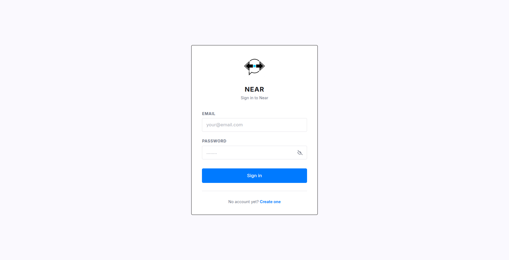
- 註冊
  填入使用者名稱、email、密碼註冊
  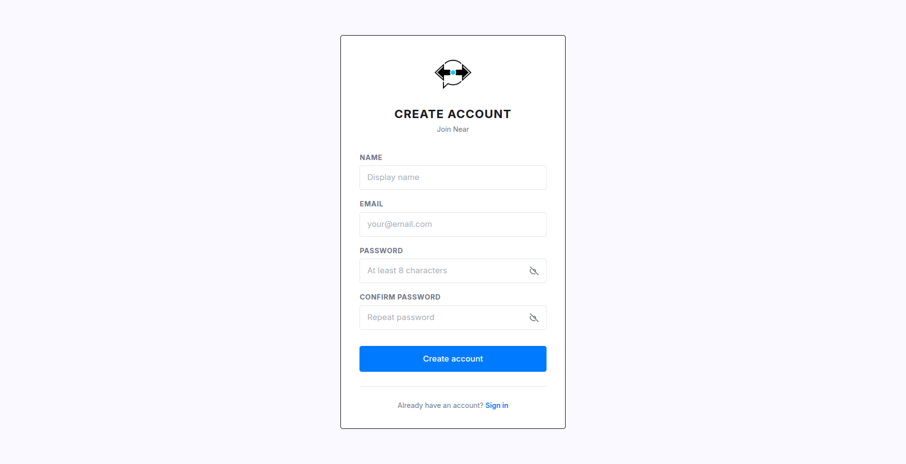

### 聊天室頁面
登入後會進到聊天室的頁面
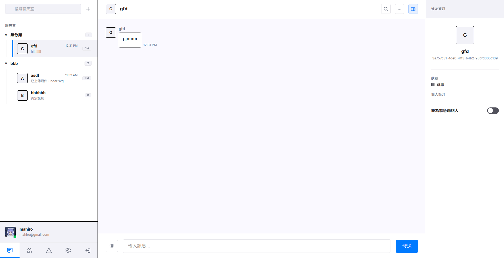
左側是聊天室列表，可以選擇要進入的聊天室。
中間是聊天室區域，可在此查看與傳送訊息。
右側私聊時顯示好友資訊，群組則顯示群組成員列表

按下右上方聊天是搜尋欄旁的 + 按鈕，會跳出一個視窗，選擇建立群組、加入群組或建立資料夾
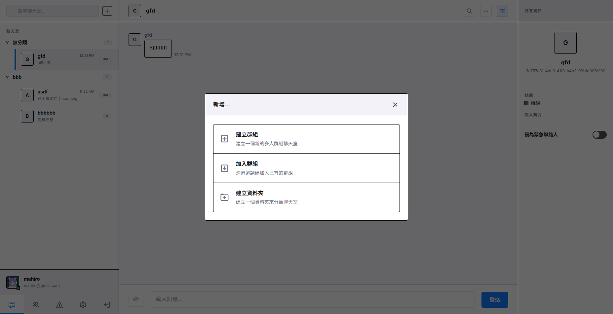

#### 聊天訊息與附件功能說明
- 可指定回覆聊天室中的某一則特定訊息，並在介面上顯示被回覆的引用內容。
- 可在訊息中以 `@成員名稱` 的格式標記聊天室內的其他成員，也可 @everyone 一次標記所有成員，被標記的成員將在介面上獲得高亮顯示或特別通知。
- 對自己的訊息按下右鍵可收回或修改訊息，收回後該訊息內容對所有成員隱藏，不會顯示。若您是群組管理員或擁有者，可以收回一般成員的訊息。
- 聊天介面會即時顯示其他成員的已讀進度（顯示誰讀到了哪一則訊息），系統在更新成員已讀進度時會進行房間安全比對，確保不會發生跨聊天室的已讀狀態混亂。
- 當其他使用者正在聊天室內輸入訊息時，訊息輸入框上方看到「xx正在輸入中...」狀態提示。
- 使用者可上傳並發送圖片或檔案作為訊息附件，供聊天室成員下載或預覽，一個訊息可附帶多個附件。

#### 群組管理
群組建立後可到設定中設定群組圖示、名稱，還有其他設定如加入審核，還有邀請碼可用於邀請其他使用者，下面是成員管理及身份設定，群組有三種身份等級：擁有者、管理員、一般成員，各自具備不同的操作與管理權限，可在下方查看各種等級的權限說明。
- 一般成員：
  - 設定自己在該群組內的專屬暱稱。
  - 分享群組邀請代碼。
- 管理員：
  - 設定群組名稱與群組圖像。
  - 設定或修改其他成員的群組暱稱。
  - 控制新加入成員是否能查看加入之前的群組歷史訊息。
  - 將違規成員禁言（限制其發送訊息的權限）或解除禁言。
  - 踢出一般成員。
  - 刪除其他成員發送的訊息。
  - 開啟或關閉加入審核機制；若開啟，負責審核新成員的加入申請。
- 擁有者：
  - 有所有管理員有的權限
  - 若要退出群組，必須先指派並將所有權轉移給群組內的另一位成員，以確保群組在任何時候都有且僅有一位擁有者。
  - 擁有者可將群組封存，封存後群組將進入唯讀狀態，成員無法再傳送新訊息，但仍可閱讀歷史對話。
  - 擁有者可將群組徹底刪除。
  - 可指派或取消管理員身分。

#### 聊天是資料夾
在聊天室列表中可以建立資料夾，在搜尋欄旁的 + 按鈕按下後選擇建立資料夾。
建立後可拖曳聊天室將其他入資料夾中，對資料夾按右鍵可選擇修改資料夾名稱或刪除資料夾。

### 個人設定
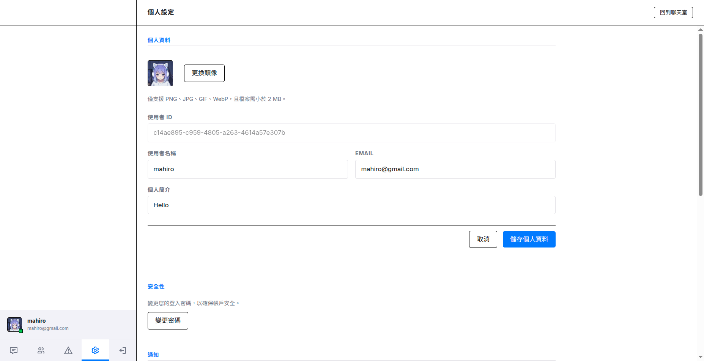
最上面是個人資料修改，包含使用者名稱、email、個人簡介、上傳貼圖，改完後記得要按儲存。
下方是其他設定，包含修改密碼、通知設定、界面深淺模式、系統語言選項，還有帳號刪除按鈕，帳號刪除後將無法在搜尋好友中被搜尋且無法再次登入，但其先前發送的聊天訊息仍會保留並用原名顯示。

### 好友管理頁面
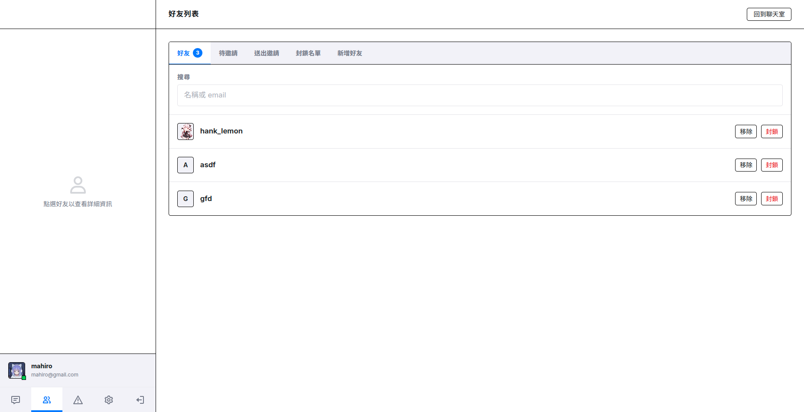
在此頁面可以管理所有的好友，進行封鎖、刪除與新增好友等動作。

在新增好友界面中，可使用使用者名稱、email、使用者 ID 搜尋，送出邀請後對方可以在待邀請中選擇接受或拒絕。
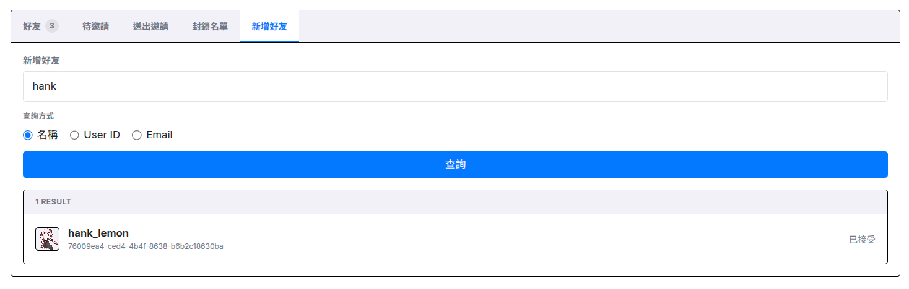

### 緊急聯絡
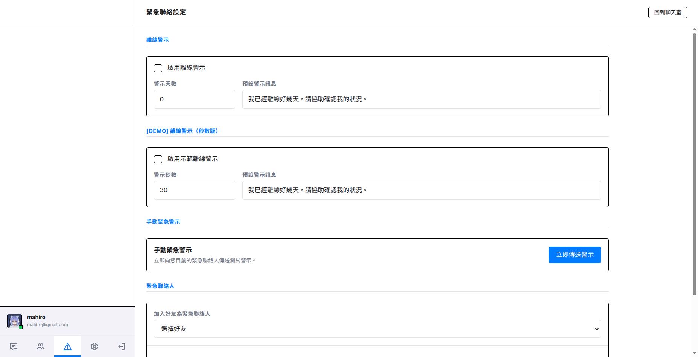
可啟用或禁用自動聯絡功能，自訂未上線的天數時限，並選擇好友作為緊急聯絡人。指定聯絡人後可自訂每個聯絡人的訊息內容。
當使用者未活躍上線的天數超過設定時限，系統會自動發送警報並將訊息送達指定的緊急聯絡人。

## 系統流程

### 註冊流程


### 登入流程
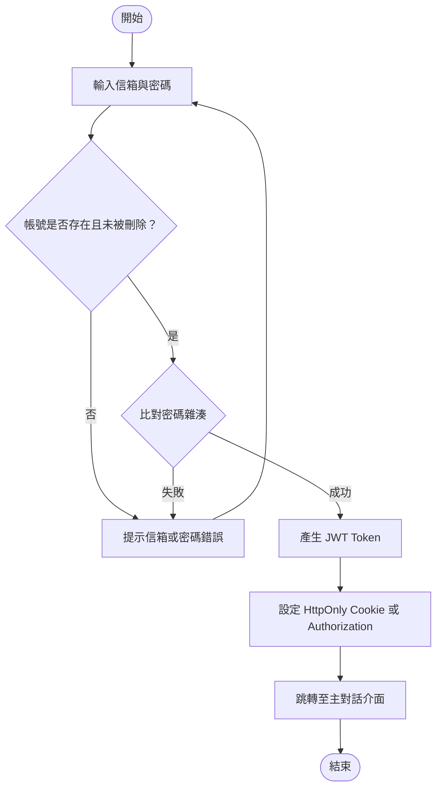

### 發送好友邀請流程


### 回應好友邀請流程
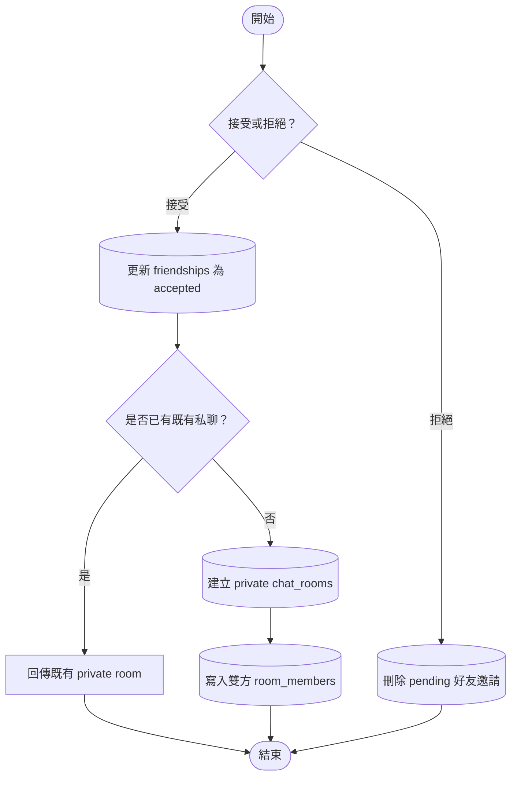

### 封鎖對象流程


### 建立群組流程
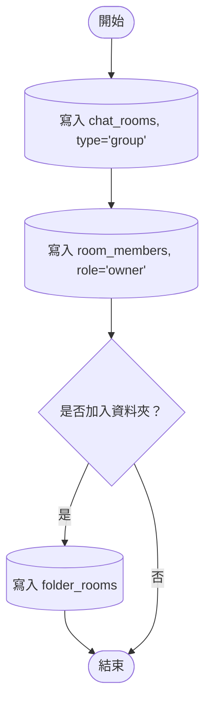

### 使用邀請碼加入群組流程


### 退出群組流程


### 封存群組流程
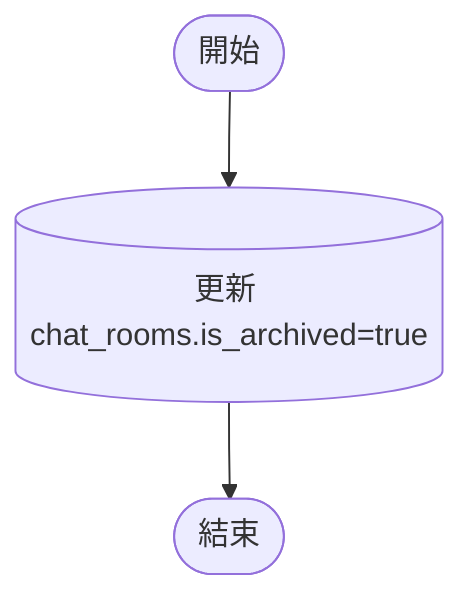

### 即時訊息發送流程


### 已讀標示更新流程


### 緊急聯絡與不活躍檢查流程

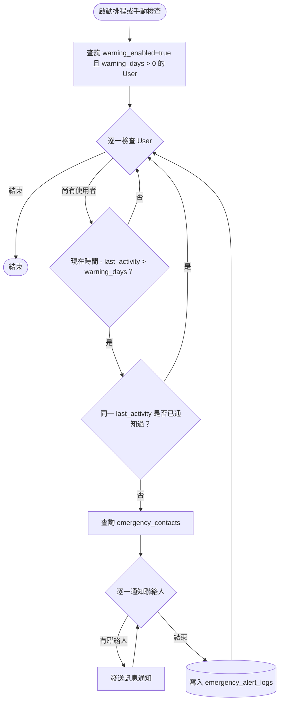

## 專案開發技術

採用容器化開發，將系統劃分為前端、後端與資料庫，並以 Docker Compose 進行本機與部署的統籌管理。

### Docker 容器化技術
- 使用 `Docker Compose` 來統籌並連接三個主要容器服務：`db`、`backend`以及 `frontend`。
- 所有環境變數皆於專案根目錄的 `.env` 檔中統一宣告，由 Docker Compose 自動注入各個容器，確保開發與生產環境設定分離。

### 前端開發技術
- 採用 `Next.js` 框架開發。
- 使用 React Context (`ChatContext`) 管理全域對話狀態與認證狀態；即時連線方面使用 `socket.io-client` 處理 WebSocket 即時事件。

### 後端開發技術
- 使用 `Node.js`、`Express` 與 `TypeScript` 建立 RESTful API 伺服器，並搭載 `Socket.IO` 實作實時雙向事件發送。
- 身分驗證基於 `JSON Web Token (JWT)`，密碼加密採用 `bcryptjs` 進行高安全性單向雜湊。
- 使用 `Routes -> Controllers -> Services -> Repositories` 分層設計。
  1. **Routes**：定義 REST API 與 middleware 組裝方式。
  2. **Controllers**：處理 HTTP request / response，呼叫對應的 Service 來執行核心邏輯。
  3. **Services**：封裝系統規則邏輯，例如群組權限檢查、封鎖限制、訊息驗證。
  4. **Repositories**：與資料庫溝通，使用 SQL 操作資料庫。


### 資料庫管理與操作 
- 使用 `PostgreSQL` 作為系統的主要關聯式資料庫。
- 使用原生 `pg` 客戶端連線池 (`pg.Pool`) 直接對資料庫下達參數化 SQL 查詢指令，確保最優化且安全的 SQL 語法執行速度。
- 使用 `node-pg-migrate` 管理資料庫結構版本，以 SQL Migration 腳本形式紀錄資料表的每一次結構變動。

## 系統功能評估

## 工作分配

- 楊銘煌：系統架設與 Docker 環境維護、UI / UX 界面設計、好友功能
- 姚承希：UI / UX 界面設計、前端開發、聊天室功能
- 趙偉恆：使用者功能、緊急聯絡功能、後端開發
- 江禹叡：後端伺服器開發、聊天訊息與即時通訊、身份驗證系統

## 個人心得

### 楊銘煌

在這一次開發之中，我練習到了很多便利的開發工具，比如 docker compose、GitHub 等等。

我覺得這次的專題是一個很寶貴的協作開發經驗。我們每個組員都具有基礎的開發能力，而且大家都有付費版的 Agent Coding 工具（Antigravity 跟 Codex）。在開發後期，我們的開發節奏逐漸成形，變成穩定的「發現問題 -> 到 GitHub 開 issue -> 用 Agent 解決 -> 在 dev 上開一個新的分支 -> 推送分支 -> 在 GitHub 開 pull request -> 合併」的流程。GitHub 有「認領/指派 issue」的功能，所以 Issues 不只是一個清楚明瞭的功能許願池，更能讓我們隨時掌握「其他組員正在做哪個功能」，而避免撞車。（還是有撞過，那就是因為尚不熟練時忘記認領）

因為我們從一開始就引入了 Git 進行開發，除了程式碼放在 repo 裡面之外，包括開發環境用的 docker-compose.yml 也一併在 repo 進行管理；甚至各次書面報告也放在 `docs/reports/`。

Docker Compose 讓我們開發時比較少受到環境的問題困擾。雖然組內有的人是用 Windows、有的用 Linux，但是沒有「程式在你那邊能跑、在我這邊不能跑」的狀況。

我在分工中比較多負責環境建置與部署的工作，因此也練習到如何用「生產模式」部署一個服務。這是我第一次面臨自己參與撰寫的網路服務需要正式部署的情況，有不少事情需要注意，比如開發用跟生產用的開發分支要分開來、CORS 設定、網域要如何串連等等。

我原先想要部署在個人的樹莓派上，但是因為編譯速度不佳，我索性直接在灌有 Linux 作業系統的電腦上進行開發＋部署。但是某一次 Agent 在經手某一個 issue 時，它直接對 container 執行指令，因此服務就壞掉了。當下甚至已經是期末 demo，導致我很慌張，還好重新建置環境（`docker compose up -d --build`）之後就順利重新上線。經過組員姚承希提醒，我才發現我其實不應該直接在 server 上進行開發，只是今天 server 同時是我的個人電腦，讓我忽略了這點。

### 姚承希
這次的專題除了對資料庫實際應用更加了解之外，也了解到事先規劃好功能、程式架構的重要性。開發前有多次報告，將所有架構、功能、開發技術都事先規劃好，開發時就有明確的目標與流程，不會不知道從哪裡開始做起。尤其是現代 AI 開發盛行的時代，有了這些文件說明，剩下的開發在 AI 協助之下可以非常快的完成，並可以讓 AI 有明確的指示，不會產出的與我們想的差異相當大，程式也有清楚的結構讓我們容易了解與修改。這次專案我也學會使用許多專案開發的工具，像是 docker, sql migration, CI/CD, unit test，避免成員之間環境或資料庫不同步等問題，並且將許多操作自動化，可減少錯誤並提升開發效率。

在資料庫操作的部份，我是做聊天室相關的部份，最難的我認為是查詢聊天通知數量，條件非常多，除了篩選特定使用者與聊天室，還有已讀訊息和群組是否可閱讀歷史訊息，有相當多欄位與規則需要一同加入查詢中。邏輯處理部份要在後端還是資料庫做，這會影響到整體的效能以及查詢次數效率，也增加了查詢語法的設計難度。

我覺得測試也是相當重要的一環，雖然一開始有根據報告所寫的進行開發，但在過程中還是漏掉漏掉一些規則，進行測試後才發現。像是即時通訊對我們的系統來說很重要，前後端分成 http 和 socket 兩種模式，很常發生沒有即時同步的問題，都是透過測試找出並修正。藉由互相測試也可以找到潛在的問題或設計不好的部份，可能是效能問題或使用體驗不佳，再進行優化與改進。

### 趙偉恆
### 江禹叡
本專題提供了實務參與並體驗資料在應用（Application）中處理流程的機會。從後端與資料庫的基礎互動出發，進而為了實現更高效的查詢、新增與修改，深入探討了資料表結構的調整（如新增特定資料表或調整 column 屬性）與查詢語法的優化。例如，透過建立適當的索引（Index）與重構複雜查詢，顯著降低了資料庫的響應時間，深刻體會到良好的資料庫設計對系統效能的影響。

我也很感謝組員在前期訂定好個Spec，有個詳細的規範能很大程度的減低後續開發的難度。在團體開發中，程式碼的整合向來最具挑戰性。團隊此次透過 GitHub Actions 實現了持續整合（CI, Continuous Integration）流程，嚴格限制任何程式碼改動皆須通過自動化單元測試與整合測試。這項機制有效減少了人工回歸測試與解決衝突（Conflict）的時間成本，確保團隊開發心力能專注於核心功能的打磨與程式碼品質的提升，驗證了現代軟體工程自動化流程對團隊協作的價值。

