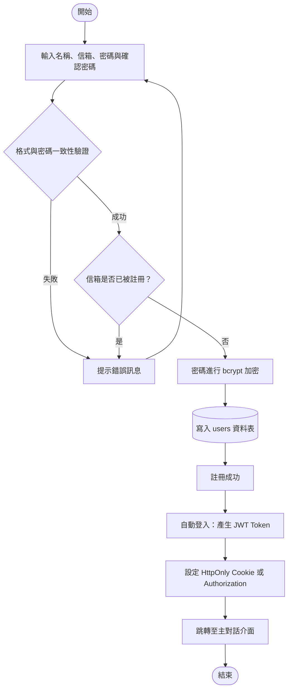
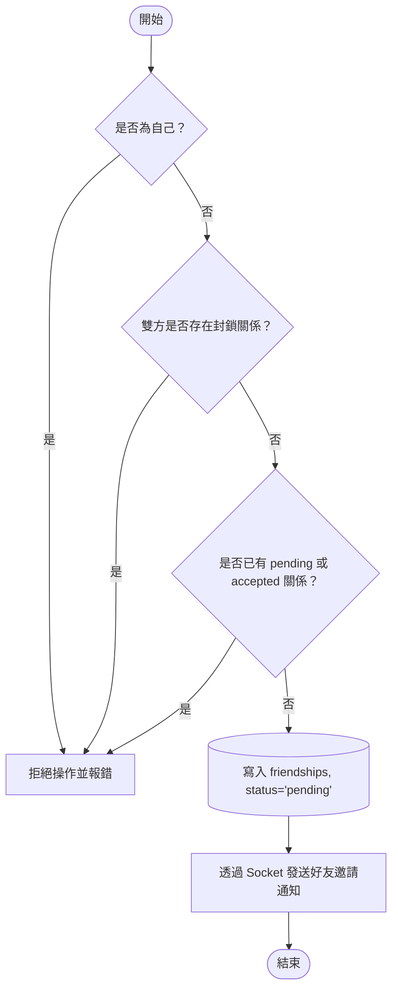
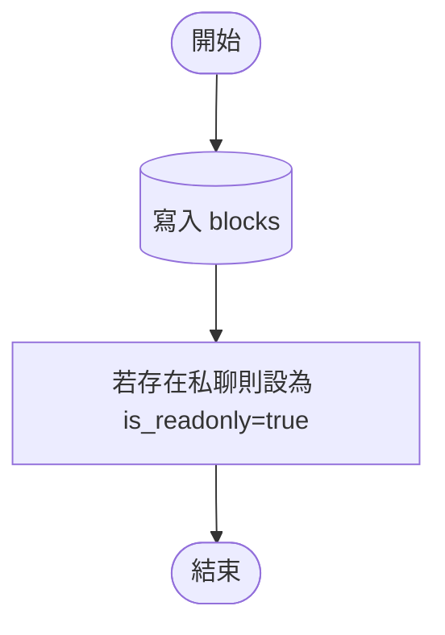
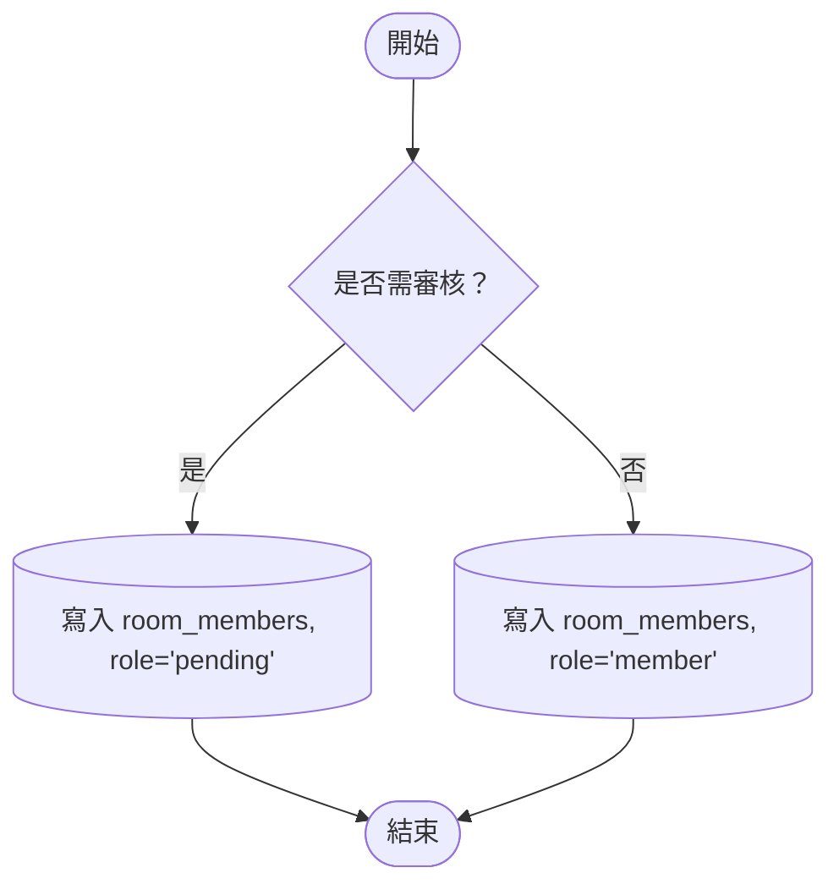
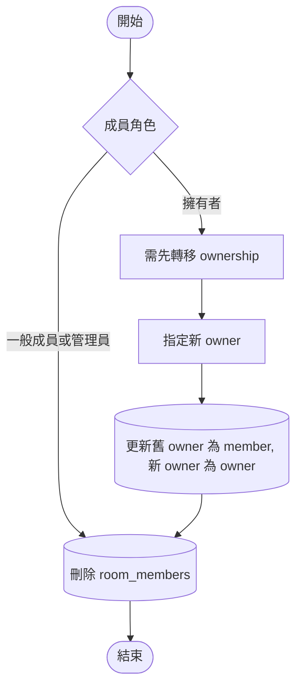
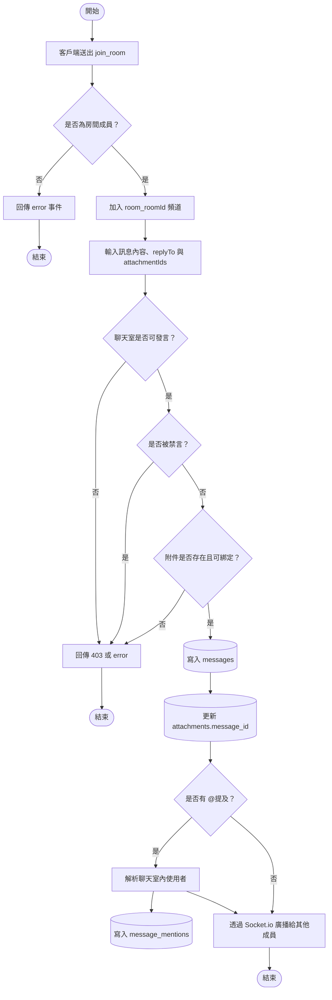
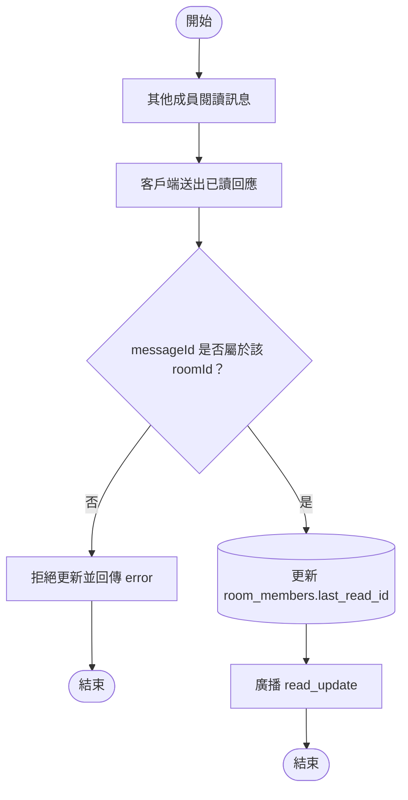

# 資料庫理論專題報告
第 9 組
專題名稱：Near Chat 即時通訊系統
組員：江禹叡、楊銘煌、趙偉恆、姚承希

### 動機
目前市面上的通訊軟體常呈現兩極化的發展：如 LINE、Messenger 等軟體雖然普及，但群組管理功能過於扁平簡單，缺乏精細的權限控管；而如 Discord 等軟體雖然權限完備，但多頻道伺服器的架構對一般使用者而言又過於龐大複雜。此外，隨著人口老化、獨居長者比例攀升，以及眾多青年學子與上班族隻身在外地求學工作，社會上對於「緊急狀態回報」與「自動聯絡」的需求日益增加。

### 專題目標

1. 實作私訊與群組聊天室
2. 打造具備高度自訂性的群組權限管理
3. 提供「聊天室分類資料夾」功能，解決聊天室雜亂問題。
4. 提供自動聯絡與緊急狀態回報功能，若多日未上線則傳送警告給緊急聯絡人。

## ER-diagram


## SQL database schema

### 核心實體表

```sql
CREATE TABLE users (
  user_id UUID PRIMARY KEY DEFAULT gen_random_uuid(),
  name VARCHAR(255) NOT NULL,
  email VARCHAR(255) NOT NULL UNIQUE,
  password_hash VARCHAR(255) NOT NULL,
  bio TEXT,
  avatar_url VARCHAR(2048),
  warning_enabled BOOLEAN NOT NULL DEFAULT false,
  warning_days INTEGER NOT NULL DEFAULT 0,
  last_activity TIMESTAMPTZ NOT NULL DEFAULT NOW(),
  created_at TIMESTAMPTZ NOT NULL DEFAULT NOW(),
  deleted_at TIMESTAMPTZ DEFAULT NULL,
);

CREATE TABLE chat_rooms (
  room_id UUID PRIMARY KEY DEFAULT gen_random_uuid(),
  type VARCHAR(10) NOT NULL CHECK (type IN ('private', 'group')),
  name VARCHAR(255),
  avatar_url VARCHAR(2048),
  invite_code VARCHAR(255),
  require_approval BOOLEAN NOT NULL DEFAULT false,
  view_history BOOLEAN NOT NULL DEFAULT true,
  is_archived BOOLEAN NOT NULL DEFAULT false,
  created_at TIMESTAMPTZ NOT NULL DEFAULT NOW()
);

CREATE UNIQUE INDEX chat_rooms_invite_code_unique
  ON chat_rooms (invite_code)
  WHERE invite_code IS NOT NULL;

CREATE TABLE messages (
  message_id UUID PRIMARY KEY DEFAULT gen_random_uuid(),
  room_id UUID NOT NULL REFERENCES chat_rooms(room_id) ON DELETE CASCADE,
  sender_id UUID REFERENCES users(user_id) ON DELETE SET NULL,
  content TEXT NOT NULL,
  reply_to_id UUID REFERENCES messages(message_id) ON DELETE SET NULL,
  is_recalled BOOLEAN NOT NULL DEFAULT false,
  sent_at TIMESTAMPTZ NOT NULL DEFAULT NOW()
);

CREATE INDEX idx_messages_pagination
  ON messages (room_id, sent_at DESC, message_id DESC);

CREATE TABLE attachments (
  attachment_id UUID PRIMARY KEY DEFAULT gen_random_uuid(),
  message_id UUID REFERENCES messages(message_id) ON DELETE CASCADE,
  uploaded_by UUID REFERENCES users(user_id) ON DELETE SET NULL,
  file_path VARCHAR(255) NOT NULL,
  file_type VARCHAR(50) NOT NULL,
  original_name VARCHAR(255) NOT NULL,
  uploaded_at TIMESTAMPTZ NOT NULL DEFAULT NOW()
);
```

### 關係、弱實體與支援表

```sql
CREATE TABLE room_members (
  room_id UUID NOT NULL REFERENCES chat_rooms(room_id) ON DELETE CASCADE,
  user_id UUID NOT NULL REFERENCES users(user_id) ON DELETE CASCADE,
  role VARCHAR(10) NOT NULL CHECK (role IN ('owner', 'admin', 'member', 'pending')),
  nickname VARCHAR(255),
  is_muted BOOLEAN NOT NULL DEFAULT false,
  last_read_id UUID REFERENCES messages(message_id) ON DELETE SET NULL,
  join_time TIMESTAMPTZ NOT NULL DEFAULT NOW(),
  PRIMARY KEY (room_id, user_id)
);

CREATE TABLE friendships (
  requester_id UUID NOT NULL REFERENCES users(user_id) ON DELETE CASCADE,
  addressee_id UUID NOT NULL REFERENCES users(user_id) ON DELETE CASCADE,
  status VARCHAR(20) NOT NULL CHECK (status IN ('pending', 'accepted')),
  created_at TIMESTAMPTZ NOT NULL DEFAULT NOW(),
  PRIMARY KEY (requester_id, addressee_id),
  CONSTRAINT friendships_no_self_friendship CHECK (requester_id <> addressee_id)
);

CREATE TABLE blocks (
  blocker_id UUID NOT NULL REFERENCES users(user_id) ON DELETE CASCADE,
  blocked_id UUID NOT NULL REFERENCES users(user_id) ON DELETE CASCADE,
  created_at TIMESTAMPTZ NOT NULL DEFAULT NOW(),
  PRIMARY KEY (blocker_id, blocked_id),
  CONSTRAINT blocks_no_self_block CHECK (blocker_id <> blocked_id)
);

CREATE TABLE folders (
  folder_id UUID PRIMARY KEY DEFAULT gen_random_uuid(),
  user_id UUID NOT NULL REFERENCES users(user_id) ON DELETE CASCADE,
  name VARCHAR(50) NOT NULL,
  created_at TIMESTAMPTZ NOT NULL DEFAULT NOW()
);

CREATE TABLE folder_rooms (
  folder_id UUID NOT NULL REFERENCES folders(folder_id) ON DELETE CASCADE,
  room_id UUID NOT NULL REFERENCES chat_rooms(room_id) ON DELETE CASCADE,
  user_id UUID NOT NULL REFERENCES users(user_id) ON DELETE CASCADE,
  PRIMARY KEY (folder_id, room_id),
  UNIQUE (user_id, room_id)
);

CREATE TABLE emergency_contacts (
  user_id UUID NOT NULL REFERENCES users(user_id) ON DELETE CASCADE,
  contact_id UUID NOT NULL REFERENCES users(user_id) ON DELETE CASCADE,
  message TEXT NOT NULL,
  created_at TIMESTAMPTZ NOT NULL DEFAULT NOW(),
  PRIMARY KEY (user_id, contact_id),
  CONSTRAINT emergency_contacts_no_self_contact CHECK (user_id <> contact_id)
);

CREATE TABLE message_mentions (
  message_id UUID NOT NULL REFERENCES messages(message_id) ON DELETE CASCADE,
  user_id UUID NOT NULL REFERENCES users(user_id) ON DELETE CASCADE,
  PRIMARY KEY (message_id, user_id)
);

CREATE TABLE emergency_alert_logs (
  user_id UUID NOT NULL REFERENCES users(user_id) ON DELETE CASCADE,
  last_activity_at TIMESTAMPTZ NOT NULL,
  alerted_at TIMESTAMPTZ NOT NULL DEFAULT NOW(),
  PRIMARY KEY (user_id, last_activity_at)
);
```

## 系統安裝說明


## 系統功能與界面說明

### 1. 帳號與個人設定
- **註冊與登入**：使用者可透過電子郵件與密碼進行註冊與登入。
- **個人資料管理**：系統紀錄使用者資訊，如顯示名稱、頭像、個人簡介等，使用者可隨時進行修改。
- **個人偏好設定**：使用者可自訂系統介面主題（深色/淺色模式）、顯示語言（繁體中文/英文），以及啟用或禁用桌面通知與訊息音效。
- **帳號刪除**：使用者可申請刪除帳號。帳號刪除後將無法被搜尋且無法再次登入，但為了保持對話歷史的完整性與脈絡，其先前發送的聊天訊息仍會保留並呈現給其他聊天成員。
- **自動聯絡模式**：使用者可啟用或禁用自動聯絡功能，自訂未上線的天數時限，並指定多位緊急聯絡人以及預設的聯絡訊息。當使用者未活躍上線的天數超過設定時限，系統會自動發送警報並將訊息送達指定的緊急聯絡人。

### 2. 好友與社交關係管理
- **好友搜尋與邀請**：使用者可透過帳號名稱、電子信箱或使用者 ID 搜尋其他使用者，並送出好友邀請，對方收到通知後可選擇接受或拒絕。
- **自動建立私聊**：當好友邀請被接受時，系統會建立雙方的好友關係。若雙方先前未曾建立私聊，系統會自動為雙方建立一個新的私訊聊天室；若已存在既有私訊聊天室，系統則會直接導向該聊天室，避免重複建立聊天室。
- **好友刪除**：使用者可刪除好友關係，刪除後雙方不再是好友，但可重新發送好友邀請。
- **封鎖機制**：使用者可單向封鎖其他使用者，封鎖後系統將拒絕對方的任何好友邀請或互動請求，且雙方的私訊聊天室將被限制為唯讀狀態。使用者亦可隨時解除封鎖。

### 3. 聊天室與群組管理
系統支援「私訊」與「群組」兩類聊天室。群組擁有四種身份等級：擁有者、管理員、一般成員、待審核，各自具備不同的操作與管理權限。
- **一般成員以上權限**：
  - 設定自己在該群組內的專屬暱稱。
  - 分享群組邀請代碼。
- **管理員與擁有者權限**：
  - 設定群組名稱與群組圖像。
  - 設定或修改其他成員的群組暱稱。
  - 控制新加入成員是否能查看加入之前的群組歷史訊息。
  - 將違規成員禁言（限制其發送訊息的權限）或解除禁言。
  - 踢出一般成員。
  - 刪除其他成員發送的訊息。
  - 開啟或關閉加入審核機制；若開啟，負責審核新成員的加入申請。
- **僅擁有者權限**：
  - **群組所有權轉移**：擁有者若欲退出群組，必須先指派並將所有權轉移給群組內的另一位成員，以確保群組在任何時候都有且僅有一位擁有者。
  - **封存群組**：擁有者可將群組封存，封存後群組將進入唯讀狀態，成員無法再傳送新訊息，但仍可閱讀歷史對話。
  - **刪除群組**：擁有者可將群組徹底刪除。
  - 指派或取消管理員身分。

### 4. 即時訊息與多媒體互動
- **即時訊息傳送**：使用者可在加入的聊天室中發送文字訊息。
- **訊息回覆與引用**：使用者可指定回覆聊天室中的某一則特定訊息，並在介面上顯示被回覆的引用內容。
- **提及標記 (@Mention)**：使用者可在訊息中以 `@成員名稱` 的格式標記聊天室內的其他成員。被標記的成員將在介面上獲得高亮顯示或特別通知。
- **訊息收回**：使用者可收回自己發送的訊息，收回後該訊息內容對所有成員隱藏，不會顯示。
- **已讀標示**：聊天介面會即時顯示其他成員的已讀進度（顯示誰讀到了哪一則訊息），系統在更新成員已讀進度時會進行房間安全比對，確保不會發生跨聊天室的已讀狀態混亂。
- **輸入狀態提示**：當使用者正在聊天室內輸入訊息時，其他成員可在聊天介面上看到即時的「正在輸入中...」狀態提示。
- **媒體附件**：使用者可上傳並發送圖片或檔案作為訊息附件，供聊天室成員下載或預覽。
- **刪除帳號訊息呈現**：若發送訊息的使用者帳號已被刪除，其發送的歷史訊息仍會保留，但訊息發送者將會顯示為空值（表示發送者已刪除）。

### 5. 聊天室資料夾分類
- **建立分類資料夾**：使用者可建立自訂資料夾，並將不同的私聊或群組聊天室加入資料夾中進行分類收納。
- **收納限制**：每個資料夾均屬於單一使用者。為維持側邊欄清晰度，同一個聊天室在同一位使用者的版面上，只能被歸類到最多一個資料夾中，不可重複分類。

## 系統流程

### 註冊流程



### 登入流程


### 發送好友邀請流程


### 回應好友邀請流程


### 封鎖對象流程


### 建立群組流程


### 使用邀請碼加入群組流程


### 退出群組流程


### 封存群組流程


### 即時訊息發送流程



### 已讀標示更新流程


### 緊急聯絡與不活躍檢查流程


## 專案開發技術

採用容器化開發，將系統劃分為前端、後端與資料庫，並以 Docker Compose 進行本機與部署的統籌管理。

### Docker 容器化技術
- 使用 `Docker Compose` 來統籌並連接三個主要容器服務：`db`、`backend`以及 `frontend`。
- 所有環境變數皆於專案根目錄的 `.env` 檔中統一宣告，由 Docker Compose 自動注入各個容器，確保開發與生產環境設定分離。

### 前端開發技術
- 採用 `Next.js` 框架開發。
- 使用 React Context (`ChatContext`) 管理全域對話狀態與認證狀態；即時連線方面使用 `socket.io-client` 處理 WebSocket 即時事件。

### 後端開發技術
- 使用 `Node.js`、`Express` 與 `TypeScript` 建立 RESTful API 伺服器，並搭載 `Socket.IO` 實作實時雙向事件發送。
- 身分驗證基於 `JSON Web Token (JWT)`，密碼加密採用 `bcryptjs` 進行高安全性單向雜湊。
- 使用 `Routes -> Controllers -> Services -> Repositories` 分層設計。
  1. **Routes**：定義 REST API 與 middleware 組裝方式。
  2. **Controllers**：處理 HTTP request / response，呼叫對應的 Service 來執行核心邏輯。
  3. **Services**：封裝系統規則邏輯，例如群組權限檢查、封鎖限制、訊息驗證。
  4. **Repositories**：與資料庫溝通，使用 SQL 操作資料庫。


### 資料庫管理與操作 
- 使用 `PostgreSQL` 作為系統的主要關聯式資料庫。
- 使用原生 `pg` 客戶端連線池 (`pg.Pool`) 直接對資料庫下達參數化 SQL 查詢指令，確保最優化且安全的 SQL 語法執行速度。
- 使用 `node-pg-migrate` 管理資料庫結構版本，以 SQL Migration 腳本形式紀錄資料表的每一次結構變動。

## 工作分配

- 楊銘煌：系統架設與 Docker 環境維護、UI / UX 界面設計、好友功能
- 姚承希：UI / UX 界面設計、前端開發、聊天室功能
- 趙偉恆：使用者功能、緊急聯絡功能、後端開發
- 江禹叡：後端伺服器開發、聊天訊息與即時通訊、身份驗證系統

## 個人心得

### 楊銘煌
### 姚承希
### 趙偉恆
### 江禹叡

